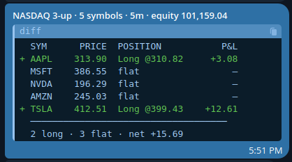

# PineconeX Documentation

> **Version:** v0.1.3-alpha · **Last updated:** 2026-07-14

PineconeX is a SaaS platform for backtesting and live-trading **Pine Script® v6** strategies against real market data. Write your strategy once — backtest it, sweep its parameters, validate that the edge is real, then deploy it live against a connected broker, all from the same interface.

**Equities and crypto.** Alongside European and US stocks, PineconeX trades **crypto** — USD and EUR spot pairs on **Bitstamp**, and the US-dollar pairs on **Alpaca**. Crypto markets never close, and the venues' order models differ from an equity broker's in ways that change how a stop-loss behaves — [read this before deploying a crypto bot](#crypto).

---

## Table of Contents

- [Getting started](#getting-started)
- [Strategies](#strategies)
  - [Learning Pine Script v6](#learning-pine-script-v6)
- [Backtest](#backtest)
- [Debugging with log.info()](#debugging-with-loginfo)
- [Parameter Sweep](#parameter-sweep)
- [Validation](#validation)
- [Machine Learning Models](#machine-learning-models)
- [Live Trading](#live-trading)
  - [Crypto](#crypto)
- [Market Data](#market-data)
  - [Supported sources](#supported-sources)
- [Brokers](#brokers)
- [Plans](#plans)

---

## Getting started

Sign in at [pineconex.com](https://pineconex.com) with your **Google account**. No separate registration is required.

> **Tip:** We recommend signing in with your GitHub account — it enables seamless version management of your strategies directly from your repositories.

On first login you are placed on the **Free** plan. A free trial period gives you temporary access to Pro features so you can explore the platform before committing.

---

## Strategies

The **Strategies** page is your library of Pine Script v6 strategies. Each strategy has a Monaco-based code editor with Pine Script syntax highlighting and an inline validator that catches errors before you submit a job.

### Learning Pine Script v6

PineconeX runs standard **Pine Script v6**, so the official TradingView documentation is your primary language reference:

- **[Pine Script v6 User Manual](https://www.tradingview.com/pine-script-docs/)** — the language guide: syntax, types, execution model, and how-to tutorials.
- **[Pine Script v6 Reference Manual](https://www.tradingview.com/pine-script-reference/v6/)** — the full API reference for every built-in function, variable, and keyword (`ta.*`, `strategy.*`, `str.*`, …).
- **[TradingView Community Scripts](https://www.tradingview.com/scripts/)** — thousands of published open-source strategies and indicators to learn from and adapt.

> **PineconeX runs Pine headless** — there is no chart, so chart/UI calls (`plot`, `hline`, drawings, tables, …) are accepted but silently ignored, and a few primitives diverge from TradingView (e.g. `alertcondition()` is repurposed for notifications, indexing an indicator call directly returns `na`). The language is the same; the runtime is backtest/live execution rather than a chart. These differences are called out throughout this guide where they matter.

### Creating a strategy

1. Click **New strategy**.
2. Give it a name and paste or write your Pine Script v6 `strategy()` code.
3. Click **Validate** to check for syntax errors.
4. Save — the strategy is now available in the Backtest, Sweep, Validation, and Live launchers.

### Importing from GitHub

Link your GitHub account under **Account → GitHub**, then use **Import from GitHub** to pull any `.pine` file from your linked repository. Imported strategies stay in sync: changes pushed to GitHub are reflected automatically. GitHub-imported strategies do not count against your strategy quota.

### Sharing a strategy

Open a strategy and click the **Share** button. You can make it:

- **Private** — only you can see it.
- **Open** — anyone with the link gets a private, editable **copy** of the strategy added to their own account (a fork). They get the full code, but as their own copy — your original is untouched.
- **Protected** — link required *plus* you grant access per user. Granted users can run backtests and live bots with the strategy, but the **source code stays private** — it is never shown to them. The strategy is shared; the code is not.

### Parameter overrides (JSON5)

For each strategy you can define parameter overrides in **JSON5** format via the **Params** editor. This lets you store a set of symbol/timeframe combinations with their tuned input values, so jobs pick them up automatically without editing the Pine source.

Format:
```json5
[
  {
    symbol: "AAPL",
    configs: [
      { tf: "1D", htf: "1W", ltf: "60m", length: 20, threshold: 0.5 },
      { tf: "60m", length: 10 }
    ]
  }
]
```

`symbol`, `tf`, `htf`, and `ltf` are **reserved keys**; every other key must match the variable name of one of your `input.*()` calls. The Params editor validates them against the parsed inputs in real time.

- **`tf`** — the primary bar resolution for that config.
- **`htf`** — optional **higher** timeframe (for `request.security`). On the Backtest form it pre-selects the higher-timeframe dataset; on live bots it maps to your strategy's `htf` input.
- **`ltf`** — optional **lower / intrabar** timeframe (for `request.security_lower_tf`). On the Backtest form it pre-selects the **Intrabar TF** dataset; on a live bot it sets the intrabar warmup resolution fetched from the broker feed. (Sweep supports intrabar too, but picks it from its own form control rather than from this key. The Significance test rejects an intrabar series — see [Validation](#validation).)

All three timeframe keys accept the same [timeframe strings](#timeframe-syntax) as the pickers.

#### Timeframe syntax

Timeframes use a uniform, minute-based notation everywhere in PineconeX (the Params JSON5, the Data catalog, and the Backtest / Sweep / Validation / Live pickers). Use these exact strings — they are case-sensitive:

| String | Resolution |
|--------|-----------|
| `1m`   | 1 minute |
| `5m`   | 5 minutes |
| `15m`  | 15 minutes |
| `30m`  | 30 minutes |
| `60m`  | 1 hour |
| `90m`  | 90 minutes |
| `1D`   | Daily |
| `1W`   | Weekly |
| `1M`   | Monthly |

Intraday resolutions are written in **minutes** (`<n>m`); daily and above use `1D` / `1W` / `1M`. The legacy `1H` (= `60m`) and `4H` (= `240m`) aliases are still accepted for backward compatibility, but prefer the minute form.

> **Live bots** trade the broker feed directly (no stored dataset), so they omit weekly/monthly and the 1-minute step — the available live timeframes are `5m`, `15m`, `30m`, `60m`, `90m`, `1D`. Keep a config's `tf` within this set if you plan to run it live.

### Trading costs & fill realism

The engine simulates the standard Pine Script v6 `strategy()` cost and fill-assumption arguments, so your backtests can reflect real-world frictions. These apply to **Backtest, Parameter Sweep, and Validation** runs (live bots submit real orders instead):

| Argument | Effect |
|----------|--------|
| `commission_type` + `commission_value` | Per-trade commission, charged on both legs. Three modes: `strategy.commission.percent` (% of each fill's value), `strategy.commission.cash_per_contract` (fixed cash per share/contract), and `strategy.commission.cash_per_order` (flat cash per order). |
| `slippage` | Worsens the fill price of every **market and stop** order by a number of ticks (0.01 price units): buys fill higher, sells fill lower. Limit / take-profit fills are exempt. |
| `backtest_fill_limits_assumption` | Models unfilled limit orders: a limit (take-profit) order only fills after price moves this many ticks *past* its price, instead of the moment price touches it. |

All default to no cost (`0`), so a strategy without these arguments backtests frictionlessly. See the inline comments in the default strategy template for exact syntax.

### Position sizing

By default a strategy trades **one share/contract per order**. Control the order size with the standard Pine Script v6 `strategy()` arguments `default_qty_type` and `default_qty_value`:

| `default_qty_type` | Order size |
|--------------------|-----------|
| `strategy.fixed` | Exactly `default_qty_value` shares/contracts. |
| `strategy.cash` | As many whole shares as `default_qty_value` (in account currency) buys — `floor(value / price)`. |
| `strategy.percent_of_equity` | A position worth `default_qty_value` % of account equity — `floor(equity × value / 100 / price)`. |

```pine
strategy("My strategy", default_qty_type = strategy.percent_of_equity, default_qty_value = 10)
```

**Live bots — things to know:**

- **Whole shares only.** Equity orders are rounded **down** to whole shares; if the computed size is below one share the order is skipped. (Crypto keeps fractional size.) Because of the round-down, a `cash` or `percent_of_equity` order usually deploys slightly *less* than the nominal amount — e.g. $5,000 of a $294 stock buys 16 shares (≈ $4,714), not a fractional 16.9.
- **`percent_of_equity` uses your real broker equity.** A live bot reads your connected account's current equity to size the order and refreshes it as the account value changes. Backtest, sweep, and validation runs use the strategy's `initial_capital` instead.

### Pyramiding

`strategy(pyramiding = N)` caps how many entries may be added in the **same direction** while a position is open. The default, `pyramiding = 0`, allows a single entry — additional same-direction entry signals are ignored until the position is closed. A reversal (an opposite-direction entry) is always allowed.

> **Current limitation:** a bot or backtest holds **one position at a time**, so a strategy trades a single lot regardless of the `pyramiding` value — setting it above `0` does not yet stack multiple lots.

### History buffer (`max_bars_back`)

`strategy(max_bars_back = N)` sets how many past bars the engine keeps so your code can reference earlier values of a **variable** (`myVar[n]`). **Omit it** and PineconeX **auto-sizes** the buffer to the deepest `[n]` lookback in your code — just like TradingView — so you never pay for history you don't reference.

Set it explicitly (0–5000) only when the depth can't be known ahead of time — e.g. a variable indexed by a **loop counter or another series** (`myVar[i]`). Then give the engine an upper bound, exactly as TradingView asks you to.

> Built-in series (`close[n]`, …) and `ta.*` functions always see full history regardless of this setting — it only bounds *user-variable* lookback.

> **Indexing an indicator's past value:** assign it to a **variable first**, then index the variable — `e = ta.ema(close, 20)` then `e[1]`. Indexing the call directly (`(ta.ema(close, 20))[1]`) returns `na` on PineconeX, unlike TradingView.

---

## Backtest

Run a single backtest of a strategy against a historical dataset.

### Configuration

| Field | Description |
|-------|-------------|
| **Strategy** | Select a strategy from your library. |
| **Symbol / Index** | Pick the market index, then the individual symbol. |
| **Timeframe** | Bar resolution for the primary series (`1M`, `1W`, `1D`, `90m`, `60m`, `30m`, `15m`, `5m`, `1m`). See [Timeframe syntax](#timeframe-syntax). |
| **Higher timeframe** | Optional — the `request.security` series. Pre-fillable from the `htf` key in your [JSON5 params](#parameter-overrides-json5). |
| **Intrabar TF** | Optional — the `request.security_lower_tf` (intrabar) series. Pre-fillable from the `ltf` key in your [JSON5 params](#parameter-overrides-json5). |
| **Date range** | Start and end date for the historical window. |
| **Data source** | Which feed the bars come from — Yahoo, Saxo, Alpaca, Bitstamp, Massive or IBKR. Only the sources that actually carry the selected symbol are offered. See [Supported sources](#supported-sources). |

### Results

Once the job completes, the results page shows:

- **Equity curve** — cumulative net profit over the backtest period.
- **Drawdown** — underwater equity plotted over time.
- **Trade list** — every entry and exit with date, price, P&L, and run-up / drawdown.
- **Metrics** — net profit, gross profit/loss, max drawdown, Sharpe ratio, win rate, profit factor, average trade, number of trades, and more.
- **Logs** — raw container output for debugging.
- **AI analysis** — optional one-click AI narrative summarising performance (requires a configured AI provider).

### Comparing backtests

Select up to **5 completed backtests** from the history list using the checkboxes, then click **Compare**. The comparison view overlays equity curves and places metrics side by side for easy evaluation.

---

## Debugging with `log.info()`

When a strategy isn't trading the way you expect, the fastest way to see *why* is to print the values your logic depends on. PineconeX supports the standard Pine Script v6 logging functions:

| Function | Use for |
|----------|---------|
| `log.info(msg)` | General trace output — values, flags, "did this branch run?" |
| `log.warning(msg)` | Something unusual but non-fatal. |
| `log.error(msg)` | A condition your strategy treats as a hard problem. |

Each message shows up in the run's **Logs** panel (Backtest, Sweep, and Validation results all have one), and streams live in a bot's **Logs** view for live trading. In a backtest each line is prefixed with the **bar timestamp** it was emitted on, so you can line the output up against the chart.

### Printing values

`log.*` takes a **single string** argument — so to print a number, a boolean, or a series value you convert it with `str.tostring()` and join the pieces with `+`:

```pine
//@version=6
strategy("Debug demo", overlay = true)

fast = ta.ema(close, 10)
slow = ta.ema(close, 30)
cross_up = ta.crossover(fast, slow)

// Print the values every bar
log.info("close=" + str.tostring(close) + " fast=" + str.tostring(fast, "0.00") + " slow=" + str.tostring(slow, "0.00") + " cross_up=" + str.tostring(cross_up))

if cross_up
    strategy.entry("Long", strategy.long)
    log.info("ENTRY long @ " + str.tostring(close, "0.00"))
```

A few things to know:

- **`str.tostring(value, "0.00")`** applies a format string — here, two decimal places. Handy for prices and indicator values that would otherwise print a long float.
- **Booleans and `na` print directly** — `str.tostring(cross_up)` gives `true` / `false`, and a `na` value prints as `na`, so you can see exactly when a value is missing.
- **Series and `ta.*` results log their current-bar value automatically.** You don't need to index them — `str.tostring(ta.rsi(close, 14))` prints this bar's RSI. (To inspect a *past* value, assign it to a variable first and index that: `r = ta.rsi(close, 14)` then `str.tostring(r[1])` — see the note on [indexing indicator values](#history-buffer-max_bars_back).)
- **No `{0}` placeholders.** Unlike TradingView, PineconeX does not support format-placeholder logging (`log.info("x={0}", x)`) — only the first argument is read, so build the whole string with `+`.

### Tracing *why* a signal did or didn't fire

The most useful pattern is logging the individual conditions that gate an entry, so you can see which one is blocking:

```pine
long_ok = cross_up and close > slow and strategy.position_size == 0

if ta.crossover(fast, slow)
    log.info("cross seen | above_slow=" + str.tostring(close > slow) + " flat=" + str.tostring(strategy.position_size == 0) + " -> entry=" + str.tostring(long_ok))
```

Now every time the EMAs cross you get one line showing exactly which guard passed or failed — far quicker than guessing.

### Keep the log readable

Logging **every bar** floods the panel and (for live bots) counts against the captured-log size cap. Gate your debug output behind the condition you actually care about so you only print on the interesting bars:

```pine
// Only log around a potential signal, not on every bar
if cross_up or cross_down
    log.info("signal bar: " + str.tostring(close, "0.00"))
```

> **Tip:** Leave the `log.*` calls gated behind an `input.bool(false, "Debug")` toggle so you can flip verbose tracing on and off without editing the strategy:
> ```pine
> debug = input.bool(false, "Debug logging")
> if debug
>     log.info("state: " + str.tostring(myVar))
> ```

---

## Parameter Sweep

Systematically search the parameter space of a strategy to find robust configurations.

### Sweep annotation

Mark which inputs to sweep by adding `//@sweep` before their `input.*()` call:

```pine
//@sweep
fast = input.int(10, minval=2, maxval=50)
//@sweep
slow = input.int(30, minval=10, maxval=200)
```

PineconeX reads the `minval` and `maxval` from each annotated input to define the search bounds automatically.

### Sweep modes

| Mode | Description |
|------|-------------|
| **RBF Optimise** | Cubic RBF surrogate model. Fewest evaluations needed; smart interpolation between sample points. The only mode that *steers* — it hill-climbs the chosen objective. Based on [Costa & Nannicini, *RBFOpt* (2016)](https://arxiv.org/pdf/1605.00998.pdf). |
| **Grid** | Exhaustive 2-D grid over the two swept parameters. Best when you need to see the full landscape. |
| **Random** | Uniform random sampling across all swept parameters. Fast, unbiased exploration. |

### Objective

The steering mode (RBF Optimise) hill-climbs a single number — the **objective**. Grid and Random
don't steer, so they have no objective: they emit every trial and you rank the results afterwards
by any metric.

Built-in objectives: `net_pnl_pct` (default), `return_over_dd`, `sharpe`, `profit_factor`,
`expectancy`, `win_rate`, and `max_dd_pct` (minimised).

**Custom expression.** Pick *Custom expression…* to write your own objective as an arithmetic
formula over the trial metrics, for example:

```
net_pnl_pct - 0.5 * max_dd_pct + 0.1 * trades
```

- Variables: `net_pnl_pct`, `max_dd_pct`, `trades`, `win_rate`, `profit_factor`, `expectancy`,
  `sharpe`, `return_over_dd`. Operators: `+ - * / ( )` and numbers.
- The search **maximises** the expression as written — a penalty term gets a minus sign.
  `max_dd_pct` is a positive percentage (a 12% drawdown is `12`), so subtract it to punish risk.
- A trial below the **Min trades** floor can never win, custom objectives included — otherwise a
  config that barely trades can score arbitrarily well (a division by zero, e.g. a zero-drawdown
  fluke in `pnl / dd`, is also disqualified rather than winning by infinity).

### Results

- **Heatmap** — net profit (or any metric) plotted as a colour grid over the two swept parameters. Reveals whether good performance is isolated (fragile) or spread across a region (robust).
- **Ranked runs** — all completed trials sorted by the chosen metric. Click any row to drill into that run's full backtest results.

### Time limits

Sweeps and backtests run under a maximum wall-clock time. A job that exceeds its limit is stopped automatically and marked **failed** — so a very large grid or a long date range may need to be narrowed to finish in time. Live bots are not time-limited.

---

## Validation

A backtest tells you what happened. Validation asks whether to believe it.

Both tests place your result against a distribution the strategy was **not** fitted to — that is
what separates them from a backtest with different settings. **Premium plan.**

### Significance — is the edge real, or luck?

The price series is **bar-permuted** hundreds of times: each bar is decomposed into its gap and its
intrabar moves, those are shuffled independently, and valid OHLC bars are rebuilt. The result keeps
the return distribution and the candle geometry but **destroys the cross-bar sequence** — the very
thing a strategy claims to exploit.

Your strategy is then run against every one of those scrambled series. If it only made money because
it happened to catch real moves in the real order, it will fall apart on them. If it keeps making
money on scrambled prices, it was never reading the market — it was reading the return distribution,
which any rule can do.

The headline number is how often the scrambled series did **as well as or better than** the real
one. Two out of two hundred means your result is hard to get by luck. Ninety out of two hundred
means it is not.

| Field | Description |
|-------|-------------|
| **Permutations** | How many scrambled series to test against (default 200). More is finer-grained: with only 50, the best result you can possibly report is "1 in 51". |
| **Test statistic** | What counts as "doing well" — `Net P&L %` (default), `Return / drawdown`, `Sharpe`, `Profit factor`, `Expectancy`, `Win rate`, or a **custom expression** over the trial metrics (same syntax as the Sweep objective, e.g. `net_pnl_pct - 0.5 * max_dd_pct`). It is both the reported statistic and, for a searching procedure, the objective the search hill-climbs inside every permutation. |
| **Permutation type** | **Bar** scrambles every bar independently — the strictest test. **Block** shuffles chunks of N bars, keeping short-term patterns intact. Use Block if your edge is meant to play out over days rather than bars. |
| **Where the settings came from** | The most important control on the page. See below. |
| **Seed** | Leave empty for a random run. The seed used is reported back, so any run can be reproduced exactly. |

#### If you found your settings with a Sweep, say so

This is the one setting that can quietly invalidate the whole test.

**Fixed params** (the default) runs your strategy with the numbers written into the script, exactly
as they are, on every shuffled series. That is the right test *if you chose those numbers yourself*
— from theory, from a book, from experience.

It is the **wrong** test if you found them with a Sweep.

Here is why. A Sweep tries many combinations and hands you the best one. Try enough combinations on
*random* data and one of them will look good too — that is guaranteed, and the more you tried, the
better the winner looks. So a strategy whose settings came out of a Sweep starts with a head start
that has nothing to do with the market. Testing it as if you had picked those numbers by hand hides
that head start completely, and gives you a reassuring result you have not earned. Running more
shuffles does not help: the bias is in *how the settings were found*, not in how many times you test
them.

So tell it what you actually did. Pick the same search you ran — Grid, Random, or RBF —
and that entire search is repeated against every shuffled series. Now your strategy has to beat not
just noise, but *the best result anyone could squeeze out of noise by tuning just as hard as you
did*. That is a fair fight, and it is the only one worth winning.

Expect it to be **much slower**. Fixed params runs your strategy once per shuffle; any other option
re-runs your whole Sweep per shuffle. A test that took seconds can take tens of minutes — and the
bigger the Sweep you ran, the longer it takes, because the bigger the Sweep, the more of a head
start there is to cancel out.

#### Out-of-sample

There is no separate mode, because out-of-sample is a **date range**. Sweep the parameters on an
earlier slice of history, then run Significance on a later slice you held back — with the parameters
fixed. Those bars were never seen by the search, so **Fixed params is the right choice there**:
there was no search on that data to correct for.

> An intrabar timeframe is not allowed here. Scrambling the bars invents a price path that never
> happened, and there is no honest way to say where inside such a bar a stop or limit would have
> filled. Rather than give you a plausible-looking number built on a fiction, the test refuses to
> run. Drop the intrabar timeframe and try again.

### Stress — which market does the strategy need?

Instead of shuffling your real prices, Stress **invents new markets**. It measures two things about
your instrument — how strongly it snaps back after a move, and how often it gaps violently — then
simulates a whole grid of markets around those values: calmer and choppier, quieter and more
jump-prone. Your strategy is run over many simulated price paths in each one.

The result is a map of **where your strategy works**: which market conditions it needs, and how much
sudden gap risk it can absorb before it breaks. A strategy that only survives in one small corner of
that map is one to be careful with — real markets do not stay in a corner.

> **Stress cannot tell you whether your edge is real — only Significance can.** The markets it
> invents are built to snap back after a move, so a mean-reversion strategy will look good on them no
> matter what, and a trend-following one will look bad no matter what. Neither result means anything
> on its own.
>
> **Run Significance first.** If your strategy cannot beat scrambled prices, nothing Stress says
> matters. Once it has passed, Stress tells you which markets it needs in order to keep working.

---

## Machine Learning Models

You can train a model **offline** — in Python, on your own machine — and then call it from a
strategy with `ml.predict()`. The model runs inside the job container on every bar, the same way
in a backtest and in a live bot, so what you validate is exactly what you trade.

PineconeX does not train models for you and does not host a training environment. It runs the
finished model. The format is **ONNX**, the open standard that PyTorch, TensorFlow/Keras and
scikit-learn can all export to.

> **Machine learning models are a [Premium](#plans) feature.**

> **A model is not an edge.** Bolting a neural network onto six popular indicators does not create
> alpha — those features have been mined by everyone for decades, and a model fit to them usually
> learns nothing that survives out-of-sample. Treat ML as one more thing to **validate**, not as a
> shortcut past validation. The most reliable use is *meta-labelling*: let a model filter the trades
> of a strategy that already passed [Significance](#significance--is-the-edge-real-or-luck), rather
> than asking it to find trades from scratch.

### Uploading a model

Go to the **Models** page, choose an `.onnx` file and give it a name. Names may contain letters,
digits, `.`, `_` and `-`. Re-uploading the same name creates a **new version** (`v2`, `v3`, …); the
old versions stay available so a strategy pinned to one keeps working.

- Maximum size is **20 MB**. Real trading models — boosted-tree-sized or a small neural net — are a
  few KB to a few MB; only very deep forests or sequence models approach the cap.
- On upload the file is checked to be a valid ONNX graph, and its input width (number of features)
  is read from it. A file that is not ONNX, or is too large, is rejected with a message.
- Machine learning models are a **Premium** feature (see [Plans](#plans)); on Premium you may store
  any number of them.

### Calling a model from Pine

Declare the model at the top of the strategy with a `//@model=` line, then call it. The model
receives an **array of features** and returns a number:

```pine
//@version=6
//@model=my-model            // latest version — or my-model:3 to pin one

strategy("ML example")

f1 = ta.rsi(close, 14) / 100
f2 = (close - ta.sma(close, 50)) / ta.stdev(close, 50)
f3 = ta.atr(14) / close

score = ml.predict("my-model", array.from(f1, f2, f3))

if not na(score) and score > 0.6 and strategy.position_size == 0
    strategy.entry("L", strategy.long)
if not na(score) and score < 0.4
    strategy.close("L")
```

- `ml.predict(name, features)` returns the first output of the model as a single number (a
  regressor's prediction, or a probability). `ml.predict_all(name, features)` returns the **whole
  output vector** as an array — use it for multi-class or multi-horizon models.
- **`na` in, `na` out.** If any feature is `na` — which it will be during the warm-up bars while
  `ta.*` fills its history — the model is not run and the result is `na`. Guard every use with
  `not na(...)` as above, so a warm-up bar can never place an order.
- The number of features you pass **must** match what the model was trained on, or the strategy
  stops with a clear error. That is deliberate — a size mismatch is a silent-disaster bug in every
  other ML setup.
- A `//@model=` for a model you have not uploaded is caught when you validate the strategy, before
  any job runs.

### Three ways to use a model

The array you pass and the number you get back are just data — how you *use* the number is the
strategy design. The three common shapes:

- **Direction** — the model predicts up/down and you trade its call. The hardest to make work; this
  is asking the model to *be* the edge.
- **Filter (meta-labelling)** — you already have entry rules; the model scores each candidate setup
  and you only take the ones it rates highly. This keeps the edge you have and drops the trades most
  likely to fail. The most productive of the three.
- **Trigger / sizing** — the model's output shifts a threshold or the position size rather than
  making the yes/no call itself.

### Getting the features right — the one thing that breaks silently

A model is only as good as the promise that **the features at training time are identical to the
features at prediction time**. `ta.rsi` re-implemented in pandas is *not* the same series as
`ta.rsi` in the interpreter — the warm-up, the smoothing and the rounding all differ — and a model
trained on the wrong numbers will look fine and trade badly.

The safe way is to let PineconeX produce your training data, so it comes from the same engine that
will run the model:

1. Write a throwaway strategy that computes your features and prints them once per bar with
   [`log.info()`](#debugging-with-loginfo):

   ```pine
   //@version=6
   strategy("feature dump")
   f1 = ta.rsi(close, 14) / 100
   f2 = (close - ta.sma(close, 50)) / ta.stdev(close, 50)
   f3 = ta.atr(14) / close
   log.info(str.tostring(f1) + "," + str.tostring(f2) + "," + str.tostring(f3) + "," + str.tostring(close))
   ```
2. Run it as a normal [backtest](#backtest) over the history you want, then download the job log —
   each line is one bar's features.
3. Train offline on that file, build your labels there (labels look into the future, so they must
   never be computed on-platform), and export the model to ONNX.
4. Upload, and use the **exact same feature expressions** in the real strategy.

### What ONNX exports work

Inference uses a self-contained CPU engine, which supports the **core ONNX maths operators**
(matrix multiply, add, the common activations) — everything a linear model or a neural network
needs. It does **not** support the specialised `ai.onnx.ml` operators, and this catches people out:

- **scikit-learn decision trees, random forests and gradient boosting** export to a
  `TreeEnsemble` operator that is **not** supported and will be rejected at run time.
- A scikit-learn **`Pipeline` with a `StandardScaler`** exports a `Scaler` operator that is also not
  supported.

Export models built from core maths instead: linear / logistic regression, an **MLP**
(`sklearn.neural_network`, or PyTorch/Keras), or trees converted to a plain tensor graph (e.g. with
[Hummingbird](https://github.com/microsoft/hummingbird)). If you need feature standardisation, fold
the mean/scale into the graph as ordinary subtract/divide steps rather than a `StandardScaler`
pipeline stage, and export the classifier **without** the ZipMap step
(`options={"zipmap": False}` in `skl2onnx`) so it returns a plain array.

> **Determinism.** The same model file and the same bars always produce the same prediction, in a
> backtest and in a live bot alike. There is no GPU and no randomness at prediction time — that is a
> feature, not a limitation, because it is what makes a backtest trustworthy.

### The discipline

The model changes nothing about how you decide whether a strategy is worth trading:

1. **Backtest** it, out-of-sample — train on an earlier slice, test on a later slice the model has
   never seen.
2. Run **[Significance](#significance--is-the-edge-real-or-luck)** on the held-out slice. A model
   adds parameters and parameters overfit, so this matters *more* with ML, not less. If the filtered
   strategy cannot beat scrambled prices, the model found a pattern in noise.
3. Only then consider it for **[live](#live-trading)** — and paper-trade it first, like any strategy.

A live bot always runs the platform's promoted engine version, so a model reaches live trading the
same way any engine feature does.

---

## Live Trading

Deploy a strategy as a live bot that connects to a broker and executes orders in real time.

> **Available on every plan.** The Free plan includes **1 live trading job** with a limited lifetime (bots are stopped at the end of the trading day); Pro and Premium raise the concurrency limit and run without that daily stop.

### Launching a bot

1. Go to **Live** and connect a broker (see [Brokers](#brokers)).
2. Select a strategy and symbol.
3. Choose the timeframe (`5m`, `15m`, `30m`, `60m`, `90m`, `1D` — see [Timeframe syntax](#timeframe-syntax)).
4. Enable **Auto-restart** if you want the bot to restart automatically after a crash.
5. Click **Launch**.

### Monitoring

Running bots are listed with their status (`running`, `stopped`, `failed`). Click **Logs** on any bot to stream its container output in real time. Bot lifecycle events (started, stopped, crashed, restarted) are recorded in the event log and can be exported as CSV.

If Telegram notifications are configured, each bot also sends a periodic **heartbeat**. A multi-symbol basket sends a single combined overview — one message with a per-symbol table (price, position, live P&L) and a net-P&L summary, colored green/red by profit and loss:



### Auto-restart

When auto-restart is on, the platform will restart the bot automatically if it crashes, up to a configured limit. The restart count is shown on the bot card.

### How orders are executed

It is important to understand how a live bot turns a strategy signal into a broker order:

- **Bots act on bar close.** On each new completed bar, the bot evaluates your strategy. A plain `strategy.entry` becomes a **market order** at that moment.
- **`limit=` and `stop=` become real broker orders.** `strategy.entry(limit=…)` places an actual resting limit order at your broker — it may fill later, or never. And `strategy.exit(limit=…, stop=…)` places a native **OCO** pair on Saxo and Alpaca equities: a resting stop and a resting take-profit, linked by the broker so that whichever one fills cancels the other. The stop moves as your strategy trails it.
- **The entry price is the broker's real fill, not the bar close.** The bot reads the executed price back from the broker (Saxo, Alpaca, Bitstamp), so `strategy.position_avg_price` — and any stop or target computed from it — is based on what you actually paid, not on a bar close that is already minutes stale.
- **PineconeX does not track your live profit & loss.** It records lifecycle events (started, stopped, crashed) and the signals it acted on, but it does not reconcile partial fills or rejections into a running P&L. **Your broker account is the source of truth** for real positions, fills, and P&L — always confirm there.

> Live results can still differ from a backtest on identical signals: a backtest fills at modelled prices at the bar close, while a live order fills at whatever the market gives you — and a live resting stop can be hit *inside* a bar, where a backtest would only have seen the bar's close. The divergence is by design: live is native, backtest is simulated.

> **Stopping a live bot does not close its position or cancel its resting orders.** The bot is shut down; whatever it holds, and any stop/take-profit orders it left at the broker, remain there unmanaged. Close them yourself in your broker's interface.

### Crypto

Crypto trades on **Bitstamp** (USD and EUR spot pairs) and **Alpaca** (US-dollar pairs). Pick the symbol under the **Crypto (USD)** or **Crypto (EUR)** index — the symbol list shows which venues carry it.

Your Pine Script does not change. What the *broker* does underneath changes a great deal, and the single most important difference is **what actually protects your position**:

| Venue | Stop-loss | Take-profit |
|-------|-----------|-------------|
| **Saxo** / **Alpaca equities** | Native, resting at the broker | Native, resting at the broker (OCO — a fill on one cancels the other) |
| **Alpaca crypto** | Native, resting at the broker | **Managed by the bot** — crypto allows only *one* resting exit, and that slot is given to the stop. The bot checks the target at each bar close and, when hit, cancels the stop and closes at market. |
| **Bitstamp** | **Managed by the bot** — Bitstamp spot has **no stop order at all** | Managed by the bot |

> **A Bitstamp stop-loss is not held at the exchange.** Bitstamp's spot market has no stop orders, no take-profits and no OCO — the API even *accepts* a stop price and answers `200 OK` with an order id, while creating nothing. So PineconeX never claims one: on Bitstamp, your stop is enforced **by the bot, at bar close**. If price gaps straight through your stop level between two bars, the bot exits on the next bar close, at whatever the market is then — not at your stop price. On a 24/7 market that gap is a real risk. Size accordingly, and prefer a shorter timeframe if the stop matters to you.

Other crypto specifics worth knowing:

- **Crypto never closes.** There is no session, no end-of-day. A bot on a 5m crypto chart runs through the night and the weekend.
- **Size is fractional.** Unlike equities, crypto orders are not rounded down to whole units — `0.0134` BTC is a valid order.
- **Fees land in different places.** On Alpaca the fee is taken **in the coin** (order 0.001 BTC, own slightly less); on Bitstamp it is taken **in the cash** (order 0.0002 BTC, receive exactly 0.0002 BTC). The bot sizes its exits from what the broker says you actually hold, so this does not strand dust — but it explains why the filled quantity may not equal the ordered one on Alpaca.
- **Neither venue allows shorting crypto.** A short entry is refused.

---

## Market Data

The **Data** page shows the market data catalog: every symbol and timeframe combination that has been fetched and is available for backtesting.

Each entry shows the data source, timeframe, date range, and row count. Use the **Fetch** button to trigger a data update for a symbol/timeframe that is missing or stale.

### Supported sources

| Source | Coverage | Notes |
|--------|----------|-------|
| **Yahoo** | Equities + crypto | The default. No account needed. **Will not serve any intraday range older than 730 days** — for older intraday bars, use Bitstamp (crypto) or Saxo (equities). |
| **Saxo Bank** | European equities (DAX, CAC40, AEX, BEL20) + US equities | Requires a connected Saxo account. Saxo carries no crypto. |
| **Alpaca** | US equities + US-dollar crypto pairs | Requires a connected Alpaca account. Crypto history **begins 2021-01-01**. |
| **Bitstamp** | Crypto — USD and EUR spot pairs, plus a few FX pairs | **No account or API key needed** — it is a public feed. Timeframes `1m`, `5m`, `15m`, `30m`, `60m`, `1D`. |
| **Massive** | Broad market data via the Massive API | — |
| **Interactive Brokers** | Equities | Requires IBKR (TWS/Gateway) configured. |

The source list offered for a symbol is filtered to the sources that actually carry it — a source that has no ticker for the symbol is not selectable.

> **For deep intraday crypto history, use Bitstamp.** It is the only source that reaches it: Yahoo cuts intraday off at 730 days and Alpaca's crypto data starts in 2021, while Bitstamp's public series goes back to **2011** and quotes real BTC/USD (not a USDT proxy). A multi-year hourly Bitcoin backtest is only reproducible from this source.

### Data retention

Fetched market data is cached so repeat jobs run instantly without re-downloading. A dataset that hasn't been used by any job for an extended period is automatically removed from the catalog to save storage. Nothing is lost permanently — the next backtest, sweep, or validation run that needs it simply re-fetches it from the source, and any dataset that is still in regular use is never evicted.

---

## Brokers

Connect a broker under **Account** or on the **Live** page.

### Saxo Bank

1. Click **Connect Saxo** and choose **Simulation** or **Live** environment.
2. You are redirected to Saxo's OAuth login.
3. After authorisation, your account is linked. Select which Saxo account to trade on.

> The simulation environment (`sim`) uses Saxo's paper-trading gateway. Recommended for testing before going live.

### Alpaca

Connect an Alpaca account to trade US equities **and crypto** (the US-dollar pairs).

1. Click **Connect Alpaca** and choose **Paper** or **Live** environment.
2. Enter your Alpaca API key and secret.
3. After connecting, your account is linked and ready to trade.

> The paper environment uses Alpaca's paper-trading API. Recommended for testing before going live.

### Bitstamp

Bitstamp is a crypto **exchange** — USD and EUR spot pairs. Your coins and cash sit at Bitstamp itself and orders go into its own book.

1. Create an API key on Bitstamp with permissions to **trade**, **view your balances**, and **view your transactions**.
2. Click **Connect Bitstamp** and choose **Sandbox** or **Live**.
3. Paste the key and secret. They are verified against Bitstamp before they are stored.

> **Sandbox is Bitstamp's only paper mode** — `Live` is real money on the real exchange. There is no third option.

> **The "view your transactions" permission is not optional.** Bitstamp's order status carries no fill price, so a bot's *only* way to learn what its order actually paid is your transaction history. A key without that permission is rejected at connect rather than failing mid-trade.

Two things about Bitstamp that do not apply to a stock broker, and that will otherwise surprise you:

- **A spot holding is a balance, not a position.** Bitstamp stores no average entry price anywhere, so a bot reconstructs its cost basis from your fill history. A coin that was **deposited** (or bought more than 30 days ago, outside the API's transaction window) has no purchase price the bot can find — so it **refuses to trade that holding** and says so in the log, rather than inventing an entry price and computing wrong P&L, stops and take-profits from it. **Fund a Bitstamp bot's account by buying the coin, not by depositing it.**
- **Spot is long-only.** A short entry is refused — there is nothing to borrow.

---

## Plans *

| | Free | Pro | Premium |
|--|------|-----|-----|
| Strategies | 5 | Unlimited | Unlimited |
| Concurrent jobs | 1 | 5 | 10 |
| Backtesting | Yes | Yes | Yes |
| Parameter sweep | Yes | Yes | Yes |
| Validation (significance + stress) | — | — | Yes |
| Machine learning models | — | — | Yes |
| Live trading | 1 job (limited lifetime) | Yes | Yes |
| Telegram notifications | — | Yes | Yes |
| Webhook signals | — | Yes | Yes |
| Multi-timeframe support | — | — | Yes |
| On-premise hosted infrastructure | — | Yes | Yes |

GitHub-imported strategies do not count against the strategy quota on any plan.

Upgrade your plan under **Account → Plan**.

> **(*)** This table is non-binding and may fall out of sync. The [pricing page](https://pineconex.com/#pricing) is the authoritative source for plan features and limits.

---

## Support

- **Website:** [pineconex.com](https://pineconex.com)
- **Telegram:** link shown on the Support page inside the app.
- **Email:** support@pineconex.com
- **General inquiries:** info@pineconex.com
