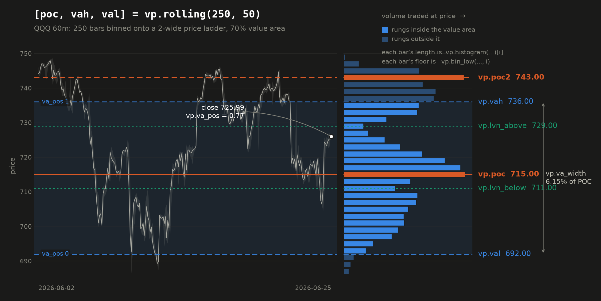
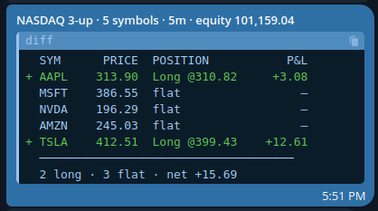

# PineconeX Documentation

> **Version:** v0.2.1-alpha

PineconeX is a SaaS platform for backtesting and live-trading **Pine Script® v6** strategies against real market data. Write your strategy once, then backtest it, sweep its parameters, validate that the edge is real, and deploy it live against a connected broker, all from the same interface.

**Equities and crypto.** Alongside European and US stocks, PineconeX trades **crypto**: USD and EUR spot pairs on **Bitstamp**, the US-dollar pairs on **Alpaca**, and the USDT pairs on **Binance**. Crypto markets never close, and the venues' order models differ from an equity broker's in ways that change how a stop-loss behaves, so [read this before deploying a crypto bot](#crypto).

---

## Table of Contents

- [Getting started](#getting-started)
- [Strategies](#strategies)
  - [Learning Pine Script v6](#learning-pine-script-v6)
  - [Write-protected strategies](#write-protected-strategies)
  - [Same-bar stop and target (the bar magnifier)](#same-bar-stop-and-target-the-bar-magnifier)
- [Backtest](#backtest)
- [Debugging with log.info()](#debugging-with-loginfo)
- [Parameter Sweep](#parameter-sweep)
- [Validation](#validation)
- [Machine Learning Models](#machine-learning-models)
  - [Training a regime model on the platform (HMM)](#training-a-regime-model-on-the-platform-hmm)
- [Gamma Exposure (GEX)](#gamma-exposure-gex)
- [Basket readings (`basket.*`)](#basket-readings-basket)
- [Volume Profile (vp.*)](#volume-profile-vp)
- [Live Trading](#live-trading)
  - [Fleet snapshot](#fleet-snapshot)
  - [Performance](#performance)
  - [Order flow: what each broker supports](#order-flow-what-each-broker-supports)
  - [Execution routing](#execution-routing)
  - [Options routing (Alpaca)](#options-routing-alpaca)
  - [Multi-symbol baskets](#multi-symbol-baskets)
  - [Crypto](#crypto)
- [Tick data vs. bar data](#tick-data-vs-bar-data)
  - [Enabling it](#enabling-it)
  - [The tape.* namespace](#the-tape-namespace)
- [Sentiment and attention](#sentiment-and-attention)
  - [Attention is not sentiment](#attention-is-not-sentiment)
  - [The three sources](#the-three-sources)
  - [Reading it in a strategy](#reading-it-in-a-strategy)
    - [The fields](#the-fields)
  - [Turning a count into a threshold](#turning-a-count-into-a-threshold)
  - [Four things to know before you trust a result](#four-things-to-know-before-you-trust-a-result)
- [Market Data](#market-data)
  - [What a bar contains (OHLCV)](#what-a-bar-contains-ohlcv)
  - [Buying and selling volume (volume delta)](#buying-and-selling-volume-volume-delta)
  - [Price structure: what the market did before your strategy](#price-structure-what-the-market-did-before-your-strategy)
  - [Supported sources](#supported-sources)
  - [Data quality: what is checked when data is fetched](#data-quality-what-is-checked-when-data-is-fetched)
  - [Reading another symbol (request.security)](#reading-another-symbol-requestsecurity-do-not-mix-vendors)
- [Futures](#futures)
  - [What a futures bar carries beyond OHLCV](#what-a-futures-bar-carries-beyond-ohlcv)
  - [Open interest](#open-interest)
  - [Volume delta on futures](#volume-delta-on-futures)
  - [Volume profile on futures](#volume-profile-on-futures)
  - [Contract rollover](#contract-rollover)
  - [Two things to know before you trust a result](#two-things-to-know-before-you-trust-a-result)
- [Brokers](#brokers)
- [Plans](#plans)

---

## Getting started

Sign in at [pineconex.com](https://pineconex.com) with your **Google account**. No separate registration is required.

> **Tip:** We recommend signing in with your GitHub account, which enables seamless version management of your strategies directly from your repositories.

On first login you are placed on the **Free** plan. A free trial period gives you temporary access to Pro features so you can explore the platform before committing.

---

## Strategies

The **Strategies** page is your library of Pine Script v6 strategies. Each strategy has a Monaco-based code editor with Pine Script syntax highlighting and an inline validator that catches errors before you submit a job.

### Learning Pine Script v6

PineconeX runs standard **Pine Script v6**, so the official TradingView documentation is your primary language reference:

- **[Pine Script v6 User Manual](https://www.tradingview.com/pine-script-docs/)**. The language guide: syntax, types, execution model, and how-to tutorials.
- **[Pine Script v6 Reference Manual](https://www.tradingview.com/pine-script-reference/v6/)**. The full API reference for every built-in function, variable, and keyword (`ta.*`, `strategy.*`, `str.*`, …).
- **[TradingView Community Scripts](https://www.tradingview.com/scripts/)**. Thousands of published open-source strategies and indicators to learn from and adapt.

For the trading side rather than the language, the **[Learn hub](https://pineconex.com/learn)** collects the books, talks and guides we recommend on systematic trading, backtesting and validation.

> **PineconeX runs Pine headless.** There is no chart, so chart/UI calls (`plot`, `hline`, drawings, tables, …) are accepted but silently ignored, and a few primitives diverge from TradingView (e.g. `alertcondition()` is repurposed for notifications, indexing an indicator call directly returns `na`). The language is the same; the runtime is backtest/live execution rather than a chart. These differences are called out throughout this guide where they matter.

### Creating a strategy

1. Click **New strategy**.
2. Give it a name and paste or write your Pine Script v6 `strategy()` code.
3. Click **Validate** to check for syntax errors.
4. Save. The strategy is now available in the Backtest, Sweep, Validation, and Live launchers.

### Importing from GitHub

Link your GitHub account under **Account → GitHub**, then use **Import from GitHub** to pull any `.pine` file from your linked repository. Imported strategies stay in sync: changes pushed to GitHub are reflected automatically. GitHub-imported strategies do not count against your strategy quota.

### Sharing a strategy

Open a strategy and click the **Share** button. You can make it:

- **Private**: only you can see it.
- **Open**: anyone with the link gets a private, editable **copy** of the strategy added to their own account (a fork). They get the full code, but as their own copy, and your original is untouched.
- **Protected**: link required *plus* you grant access per user. Granted users can run backtests and live bots with the strategy, but the **source code stays private**: it is never shown to them. The strategy is shared; the code is not.

### Write-protected strategies

A strategy is locked against editing while a live bot is running it, or while it is held in your [fleet snapshot](#fleet-snapshot). The tile shows a **Write-protected** badge, the editor opens read-only, and Save is replaced by an explanation. Validate still works, since reading and checking a file is always safe.

The reason is not caution, it is that editing would not do what it looks like it does. **A bot runs the code it was launched with.** The source is copied into the bot when it starts and is never re-read, so editing the file under a running bot cannot change what is trading. All it would do is make the file disagree with the account, on the very page you would look at to find out what a bot is running.

The snapshot extends the same protection forward in time. Restore relaunches from the file as it reads then, so an edit made while the bots are down would change what Restore starts, and the snapshot would name one fleet and start another.

The `.pine` and its `.json5` lock together, because a bot froze both when it launched.

To edit a locked strategy, stop the bot, or save a new snapshot that does not include it. If you want to try changes while a bot keeps running, copy the strategy and edit the copy.

This applies to strategies **hosted on PineconeX**. A strategy imported from GitHub is already read-only here, and its real file lives in your repository, where this platform cannot protect it.

Alongside the badge, each tile shows either a live indicator (how many bots are running it right now) or the date it last ran live, never both.

### Parameter overrides (JSON5)

For each strategy you can define parameter overrides in **JSON5** format via the **Params** editor. This lets you store a set of symbol/timeframe combinations with their tuned input values, so jobs pick them up automatically without editing the Pine source.

Format:
```json5
[
  {
    symbol: "AAPL",
    configs: [
      { tf: "1D", htf: "1W", ltf: "60m", length: 20, threshold: 0.5 },
      { tf: "60m", length: 10 }
    ]
  }
]
```

`symbol`, `tf`, `htf`, and `ltf` are **reserved keys**; every other key must match the variable name of one of your `input.*()` calls. The Params editor validates them against the parsed inputs in real time.

- **`tf`**: the primary bar resolution for that config.
- **`htf`**: optional **higher** timeframe (for `request.security`). On the Backtest form it pre-selects the higher-timeframe dataset; on live bots it maps to your strategy's `htf` input.
- **`ltf`**: optional **lower / intrabar** timeframe (for `request.security_lower_tf`). On the Backtest form it pre-selects the **Intrabar TF** dataset; on a live bot it sets the intrabar warmup resolution fetched from the broker feed. (Sweep supports intrabar too, but picks it from its own form control rather than from this key. The Significance test rejects an intrabar series, see [Validation](#validation).)

All three timeframe keys accept the same [timeframe strings](#timeframe-syntax) as the pickers.

#### Timeframe syntax

Timeframes use a uniform, minute-based notation everywhere in PineconeX (the Params JSON5, the Data catalog, and the Backtest / Sweep / Validation / Live pickers). Use these exact strings; they are case-sensitive:

| String | Resolution |
|--------|-----------|
| `1m`   | 1 minute |
| `5m`   | 5 minutes |
| `15m`  | 15 minutes |
| `30m`  | 30 minutes |
| `60m`  | 1 hour |
| `90m`  | 90 minutes |
| `1D`   | Daily |
| `1W`   | Weekly |
| `1M`   | Monthly |

Intraday resolutions are written in **minutes** (`<n>m`); daily and above use `1D` / `1W` / `1M`. The legacy `1H` (= `60m`) and `4H` (= `240m`) aliases are still accepted for backward compatibility, but prefer the minute form.

> **Live bots** trade the broker feed directly (no stored dataset), so they omit weekly/monthly and the 1-minute step. The available live timeframes are `5m`, `15m`, `30m`, `60m`, `90m`, `1D`. Keep a config's `tf` within this set if you plan to run it live.

### Trading costs & fill realism

The engine simulates the standard Pine Script v6 `strategy()` cost and fill-assumption arguments, so your backtests can reflect real-world frictions. These apply to **Backtest, Parameter Sweep, and Validation** runs (live bots submit real orders instead):

| Argument | Effect |
|----------|--------|
| `commission_type` + `commission_value` | Per-trade commission, charged on both legs. Three modes: `strategy.commission.percent` (% of each fill's value), `strategy.commission.cash_per_contract` (fixed cash per share/contract), and `strategy.commission.cash_per_order` (flat cash per order). |
| `slippage` | Worsens the fill price of every **market and stop** order by a number of ticks (0.01 price units): buys fill higher, sells fill lower. Limit / take-profit fills are exempt. |
| `backtest_fill_limits_assumption` | Models unfilled limit orders: a limit (take-profit) order only fills after price moves this many ticks *past* its price, instead of the moment price touches it. |

All default to no cost (`0`), so a strategy without these arguments backtests frictionlessly. See the inline comments in the default strategy template for exact syntax.

### Same-bar stop and target (the bar magnifier)

When one bar's range touches **both** a resting stop and a resting take-profit, the bar's four prices cannot say which one price reached first. The engine's default is to book the **take-profit**, which is optimistic and flatters every bracket strategy.

`strategy(use_bar_magnifier = true)` resolves those ties from finer data instead:

| Where | How a tie is resolved |
|-------|-----------------------|
| **Backtest** and **Sweep** | The engine walks the **Intrabar (LTF)** sub-bars inside the ambiguous bar and books whichever leg price actually reached first. A single sub-bar that touches both legs is itself ambiguous, so the **stop** wins there. If no sub-bar covers the bar, it falls back to the optimistic default rather than inventing a worse result from missing data. |
| **Significance** and **Stress** | The permutation null rebuilds every bar, so real sub-bars cannot apply. The tie is resolved from the recomposed bar's own OHLC with a driftless Brownian bridge, `P(low before high) = (high − open) / (high − low)`, booking the more likely leg first, with an exact 50/50 breaking to the stop. Deterministic on purpose: the only randomness stays the seeded shuffle, so the p-value remains reproducible. |

- **In a backtest or sweep the flag needs an intrabar series.** Without one it is a silent no-op (a warning appears in the log). Pick an **Intrabar TF** on the form, or set `ltf` in your [JSON5 params](#parameter-overrides-json5). Validation needs no series; it resolves ties from the bar itself.
- **It is opt-in and inert by default.** A strategy without the flag produces byte-identical results to before.
- **Expect the numbers to get worse when you switch it on.** That is the point. On real 15-minute sub-bars under a 1-hour chart, a bracket strategy moved from a 62% win rate and 1.70 profit factor to 55% and 1.28. Nothing was lost; the optimistic bias was removed.

### Position sizing

By default a strategy trades **one share/contract per order**. Control the order size with the standard Pine Script v6 `strategy()` arguments `default_qty_type` and `default_qty_value`:

| `default_qty_type` | Order size |
|--------------------|-----------|
| `strategy.fixed` | Exactly `default_qty_value` shares/contracts. |
| `strategy.cash` | As many whole shares as `default_qty_value` (in account currency) buys: `floor(value / price)`. |
| `strategy.percent_of_equity` | A position worth `default_qty_value` % of account equity: `floor(equity × value / 100 / price)`. |

```pine
strategy("My strategy", default_qty_type = strategy.percent_of_equity, default_qty_value = 10)
```

**What to know about live bots:**

- **Whole shares only.** Equity orders are rounded **down** to whole shares; if the computed size is below one share the order is skipped. (Crypto keeps fractional size.) Because of the round-down, a `cash` or `percent_of_equity` order usually deploys slightly *less* than the nominal amount: $5,000 of a $294 stock buys 16 shares (≈ $4,714), not a fractional 16.9.
- **`percent_of_equity` uses your real broker equity.** A live bot reads your connected account's current equity to size the order and refreshes it as the account value changes. Backtest, sweep, and validation runs use the strategy's `initial_capital` instead.

> Sizing each order from the market's current volatility, instead of a fixed cash or equity fraction, is a separate feature: see [Basket readings (`basket.*`)](#basket-readings-basket).

#### Margin and leverage (`margin_long` / `margin_short`)

Both default to **100**, meaning full cash cover and no leverage, exactly as Pine Script v6 does, and an entry that would need more money than the account has is **not opened**. So `default_qty_type = strategy.percent_of_equity, default_qty_value = 400` no longer quietly borrows four times your equity; it is capped at what you can actually pay for.

If you *want* leverage, say so: `strategy(..., margin_long = 25)` is 4× (25% of the position value must be covered). An explicit `margin_long = 0` also maps to 100 rather than to "unlimited", because reading a 0% requirement literally would mean infinite leverage, which is the most dangerous possible interpretation.

> **This changes historical backtest numbers.** A strategy that was implicitly over-leveraging now reports lower, realistic results, because the entries it could not afford are no longer taken. TradingView would not have taken them either, and that is what makes a PineconeX backtest and a TradingView backtest of the same script agree.

> **Our margin limit is not your broker's.** It never goes over the wire: an order carries only a quantity, and your broker applies its own Reg T / maintenance rules independently. The two never talk, which is exactly why ours must not be looser than theirs. On a live bot, see [Margin monitoring](#margin-monitoring).

### Pyramiding

`strategy(pyramiding = N)` caps how many entries may be added in the **same direction** while a position is open. The default, `pyramiding = 0`, allows a single entry, so additional same-direction entry signals are ignored until the position is closed. A reversal (an opposite-direction entry) is always allowed.

Entries **stack**: with `pyramiding = 3`, three same-direction entries build one larger position and the fourth is refused until the position closes. It works the same way in a backtest, a sweep and a live bot.

> **Each entry is sized in full.** `default_qty_value = 25` with `pyramiding = 4` commits **100%** of equity, not 25% split four ways. Size for the stack you intend to hold rather than for one entry.

> **Stacked entries close as one trade.** PineconeX holds a single netted position rather than a list of individual entries, so three stacked entries exit together, as **one** trade at their size-weighted average price. TradingView unwinds each entry separately. The total profit and loss agrees; the trade **list** and the trade **count** do not. That is also why `close_entries_rule` (FIFO vs ANY) has nothing to decide here, and is accepted and ignored.

> **A pyramiding entry must be a market order.** A resting `limit=` or `stop=` entry cannot be added to a position that is already open, because a resting order cannot be matched against the position it would join. In a backtest such an order rests until it fills or expires; a live bot refuses it and says so in the job log.

> **Results recorded before 2026-08-18 were measured without this.** `pyramiding` was read and then had no effect, so a strategy setting it above `0` traded a single lot. If you have numbers for such a strategy from before that date, re-run it: the old figures describe a smaller system. Strategies left at the default `0` are unaffected and their numbers stand.

### Resizing a position (`strategy.order`)

`strategy.order(id, direction, qty = n)` changes the size of a position that is already open, and unlike `strategy.entry` it ignores `pyramiding` entirely. It is how a strategy rebalances: volatility targeting, risk parity, rebalancing bands, and Kelly sizing all hold one position and adjust it as their estimate moves.

Three cases, and the accounting differs in each:

| the order is | what happens |
|---|---|
| the **same** direction | the position grows, and its cost basis becomes the size-weighted average of the old basis and this fill |
| **opposite**, smaller | the position shrinks. The closed part books a real trade at the original basis; what remains keeps that basis, because selling part of a holding does not change what the rest cost |
| **opposite**, larger | the position closes and the surplus opens the other way, as TradingView does |

> **A reverse is refused where the venue cannot hold a short.** Bitstamp spot and Alpaca crypto are long only, so the closing part is placed and the surplus is refused rather than sent. The bot ends flat, and says so in the job log. Alpaca equities can hold a short, and the bot asks your account whether it may before opening one.

> **Results recorded before 2026-08-18 were measured without this too.** `strategy.order` was accepted and did nothing at all, with no error and no log line, so a rebalancing strategy sized its position once and then held it unchanged. The tell is a strategy that reports **one trade** whose return equals the instrument's own price move.

### History buffer (`max_bars_back`)

`strategy(max_bars_back = N)` sets how many past bars the engine keeps so your code can reference earlier values of a **variable** (`myVar[n]`). **Omit it** and PineconeX **auto-sizes** the buffer to the deepest `[n]` lookback in your code, just like TradingView, so you never pay for history you don't reference.

Set it explicitly (0–5000) only when the depth can't be known ahead of time, e.g. a variable indexed by a **loop counter or another series** (`myVar[i]`). Then give the engine an upper bound, exactly as TradingView asks you to.

> Built-in series (`close[n]`, …) and `ta.*` functions always see full history regardless of this setting; it only bounds *user-variable* lookback.

> **Indexing an indicator's past value:** assign it to a **variable first**, then index the variable: `e = ta.ema(close, 20)` then `e[1]`. Indexing the call directly (`(ta.ema(close, 20))[1]`) returns `na` on PineconeX, unlike TradingView.

---

## Backtest

Run a single backtest of a strategy against a historical dataset.

### Configuration

| Field | Description |
|-------|-------------|
| **Strategy** | Select a strategy from your library. |
| **Symbol / Index** | Pick the market index, then the individual symbol. |
| **Timeframe** | Bar resolution for the primary series (`1M`, `1W`, `1D`, `90m`, `60m`, `30m`, `15m`, `5m`, `1m`). See [Timeframe syntax](#timeframe-syntax). |
| **Higher timeframe** | Optional. The `request.security` series. Pre-fillable from the `htf` key in your [JSON5 params](#parameter-overrides-json5). |
| **Intrabar TF** | Optional. The `request.security_lower_tf` (intrabar) series. Pre-fillable from the `ltf` key in your [JSON5 params](#parameter-overrides-json5). Also the series [`use_bar_magnifier`](#same-bar-stop-and-target-the-bar-magnifier) resolves same-bar stop/target ties from. Without it, the flag does nothing. |
| **Date range** | Start and end date for the historical window. |
| **Data source** | Which feed the bars come from: Yahoo, Saxo, Alpaca, Bitstamp, Massive or IBKR. Only the sources that actually carry the selected symbol are offered. See [Supported sources](#supported-sources). |

### Results

Once the job completes, the results page shows:

- **Equity curve**: cumulative net profit over the backtest period.
- **Drawdown**: underwater equity plotted over time.
- **Trade list**: every entry and exit with date, price, P&L, and run-up / drawdown.
- **Metrics**: net profit, gross profit/loss, max drawdown, Sharpe ratio, win rate, profit factor, average trade, number of trades, and more.
- **Logs**: raw container output for debugging.
- **AI analysis**: optional one-click AI narrative summarising performance (requires a configured AI provider).

> The report used to carry a **Data** block (Hurst, variance ratio, price structure). It has moved
> to the Data page's [Structure tab](#price-structure-what-the-market-did-before-your-strategy),
> because it described the *price series*, so it was identical for every strategy ever run on that
> dataset, the same three numbers on every winner and every loser, sitting next to figures that
> really were the strategy's.

### Comparing backtests

Select up to **5 completed backtests** from the history list using the checkboxes, then click **Compare**. The comparison view overlays equity curves and places metrics side by side for easy evaluation.

---

## Debugging with `log.info()`

When a strategy isn't trading the way you expect, the fastest way to see *why* is to print the values your logic depends on. PineconeX supports the standard Pine Script v6 logging functions:

| Function | Use for |
|----------|---------|
| `log.info(msg)` | General trace output: values, flags, "did this branch run?" |
| `log.warning(msg)` | Something unusual but non-fatal. |
| `log.error(msg)` | A condition your strategy treats as a hard problem. |

Each message shows up in the run's **Logs** panel (Backtest, Sweep, and Validation results all have one), and streams live in a bot's **Logs** view for live trading. In a backtest each line is prefixed with the **bar timestamp** it was emitted on, so you can line the output up against the chart.

### Printing values

`log.*` takes a **single string** argument, so to print a number, a boolean, or a series value you convert it with `str.tostring()` and join the pieces with `+`:

```pine
//@version=6
strategy("Debug demo", overlay = true)

fast = ta.ema(close, 10)
slow = ta.ema(close, 30)
cross_up = ta.crossover(fast, slow)

// Print the values every bar
log.info("close=" + str.tostring(close) + " fast=" + str.tostring(fast, "0.00") + " slow=" + str.tostring(slow, "0.00") + " cross_up=" + str.tostring(cross_up))

if cross_up
    strategy.entry("Long", strategy.long)
    log.info("ENTRY long @ " + str.tostring(close, "0.00"))
```

A few things to know:

- **`str.tostring(value, "0.00")`** applies a format string, here two decimal places. Handy for prices and indicator values that would otherwise print a long float.
- **Booleans and `na` print directly.** `str.tostring(cross_up)` gives `true` / `false`, and a `na` value prints as `na`, so you can see exactly when a value is missing.
- **Series and `ta.*` results log their current-bar value automatically.** You don't need to index them: `str.tostring(ta.rsi(close, 14))` prints this bar's RSI. (To inspect a *past* value, assign it to a variable first and index that: `r = ta.rsi(close, 14)` then `str.tostring(r[1])`; see the note on [indexing indicator values](#history-buffer-max_bars_back).)
- **No `{0}` placeholders.** Unlike TradingView, PineconeX does not support format-placeholder logging (`log.info("x={0}", x)`); only the first argument is read, so build the whole string with `+`.

### Tracing *why* a signal did or didn't fire

The most useful pattern is logging the individual conditions that gate an entry, so you can see which one is blocking:

```pine
long_ok = cross_up and close > slow and strategy.position_size == 0

if ta.crossover(fast, slow)
    log.info("cross seen | above_slow=" + str.tostring(close > slow) + " flat=" + str.tostring(strategy.position_size == 0) + " -> entry=" + str.tostring(long_ok))
```

Now every time the EMAs cross you get one line showing exactly which guard passed or failed, far quicker than guessing.

### Keep the log readable

Logging **every bar** floods the panel and (for live bots) counts against the captured-log size cap. Gate your debug output behind the condition you actually care about so you only print on the interesting bars:

```pine
// Only log around a potential signal, not on every bar
if cross_up or cross_down
    log.info("signal bar: " + str.tostring(close, "0.00"))
```

> **Tip:** Leave the `log.*` calls gated behind an `input.bool(false, "Debug")` toggle so you can flip verbose tracing on and off without editing the strategy:
> ```pine
> debug = input.bool(false, "Debug logging")
> if debug
>     log.info("state: " + str.tostring(myVar))
> ```

---

## Parameter Sweep

Systematically search the parameter space of a strategy to find robust configurations.

### Sweep annotation

Mark which inputs to sweep by adding `//@sweep` before their `input.*()` call:

```pine
//@sweep
fast = input.int(10, minval=2, maxval=50)
//@sweep
slow = input.int(30, minval=10, maxval=200)
```

PineconeX reads the `minval` and `maxval` from each annotated input to define the search bounds automatically.

### Sweep modes

| Mode | Description |
|------|-------------|
| **RBF Optimise** | Cubic RBF surrogate model. Fewest evaluations needed; smart interpolation between sample points. The only mode that *steers*: it hill-climbs the chosen objective. Based on [Costa & Nannicini, *RBFOpt* (2016)](https://arxiv.org/pdf/1605.00998.pdf). |
| **Grid** | Exhaustive 2-D grid over the two swept parameters. Best when you need to see the full landscape. |
| **Random** | Uniform random sampling across all swept parameters. Fast, unbiased exploration. |

### Objective

The steering mode (RBF Optimise) hill-climbs a single number, the **objective**. Grid and Random
don't steer, so they have no objective: they emit every trial and you rank the results afterwards
by any metric.

Built-in objectives: `net_pnl_pct` (default), `return_over_dd`, `sharpe`, `profit_factor`,
`expectancy`, `win_rate`, and `max_dd_pct` (minimised).

**Custom expression.** Pick *Custom expression…* to write your own objective as an arithmetic
formula over the trial metrics, for example:

```
net_pnl_pct - 0.5 * max_dd_pct + 0.1 * trades
```

- Variables: `net_pnl_pct`, `max_dd_pct`, `trades`, `win_rate`, `profit_factor`, `expectancy`,
  `sharpe`, `return_over_dd`. Operators: `+ - * / ( )` and numbers.
- The search **maximises** the expression as written, so a penalty term gets a minus sign.
  `max_dd_pct` is a positive percentage (a 12% drawdown is `12`), so subtract it to punish risk.
- A trial below the **Min trades** floor can never win, custom objectives included, because otherwise a
  config that barely trades can score arbitrarily well (a division by zero, e.g. a zero-drawdown
  fluke in `pnl / dd`, is also disqualified rather than winning by infinity).

### Results

- **Heatmap**: net profit (or any metric) plotted as a colour grid over the two swept parameters. Reveals whether good performance is isolated (fragile) or spread across a region (robust).
- **Ranked runs**: all completed trials sorted by the chosen metric. Click any row to drill into that run's full backtest results.

### Time limits

Sweeps and backtests run under a maximum wall-clock time. A job that exceeds its limit is stopped automatically and marked **failed**, so a very large grid or a long date range may need to be narrowed to finish in time. Live bots are not time-limited.

---

## Validation

A backtest tells you what happened. Validation asks whether to believe it.

Both tests place your result against a distribution the strategy was **not** fitted to, and that is
what separates them from a backtest with different settings. **Premium plan.**

### Significance: is the edge real, or luck?

The price series is **bar-permuted** hundreds of times: each bar is decomposed into its gap and its
intrabar moves, those are shuffled independently, and valid OHLC bars are rebuilt. The result keeps
the return distribution and the candle geometry but **destroys the cross-bar sequence**, the very
thing a strategy claims to exploit.

Your strategy is then run against every one of those scrambled series. If it only made money because
it happened to catch real moves in the real order, it will fall apart on them. If it keeps making
money on scrambled prices, it was never reading the market. It was reading the return distribution,
which any rule can do.

The headline number is how often the scrambled series did **as well as or better than** the real
one. Two out of two hundred means your result is hard to get by luck. Ninety out of two hundred
means it is not.

| Field | Description |
|-------|-------------|
| **Permutations** | How many scrambled series to test against (default 200). More is finer-grained: with only 50, the best result you can possibly report is "1 in 51". |
| **Test statistic** | What counts as "doing well": `Net P&L %` (default), `Return / drawdown`, `Sharpe`, `Profit factor`, `Expectancy`, `Win rate`, or a **custom expression** over the trial metrics (same syntax as the Sweep objective, e.g. `net_pnl_pct - 0.5 * max_dd_pct`). It is both the reported statistic and, for a searching procedure, the objective the search hill-climbs inside every permutation. |
| **Permutation type** | **Bar** scrambles every bar independently, the strictest test. **Block** shuffles chunks of N bars, keeping short-term patterns intact. Use Block if your edge is meant to play out over days rather than bars. |
| **Where the settings came from** | The most important control on the page. See below. |
| **Seed** | Leave empty for a random run. The seed used is reported back, so any run can be reproduced exactly. |

#### If you found your settings with a Sweep, say so

This is the one setting that can quietly invalidate the whole test.

**Fixed params** (the default) runs your strategy with the numbers written into the script, exactly
as they are, on every shuffled series. That is the right test *if you chose those numbers yourself*,
from theory, from a book, from experience.

It is the **wrong** test if you found them with a Sweep.

Here is why. A Sweep tries many combinations and hands you the best one. Try enough combinations on
*random* data and one of them will look good too. That is guaranteed, and the more you tried, the
better the winner looks. So a strategy whose settings came out of a Sweep starts with a head start
that has nothing to do with the market. Testing it as if you had picked those numbers by hand hides
that head start completely, and gives you a reassuring result you have not earned. Running more
shuffles does not help: the bias is in *how the settings were found*, not in how many times you test
them.

So tell it what you actually did. Pick the same search you ran, Grid, Random, or RBF,
and that entire search is repeated against every shuffled series. Now your strategy has to beat not
just noise, but *the best result anyone could squeeze out of noise by tuning just as hard as you
did*. That is a fair fight, and it is the only one worth winning.

Expect it to be **much slower**. Fixed params runs your strategy once per shuffle; any other option
re-runs your whole Sweep per shuffle. A test that took seconds can take tens of minutes, and the
bigger the Sweep you ran, the longer it takes, because the bigger the Sweep, the more of a head
start there is to cancel out.

#### Out-of-sample

There is no separate mode, because out-of-sample is a **date range**. Sweep the parameters on an
earlier slice of history, then run Significance on a later slice you held back, with the parameters
fixed. Those bars were never seen by the search, so **Fixed params is the right choice there**:
there was no search on that data to correct for.

> An intrabar timeframe is not allowed here. Scrambling the bars invents a price path that never
> happened, and there is no honest way to say where inside such a bar a stop or limit would have
> filled. Rather than give you a plausible-looking number built on a fiction, the test refuses to
> run. Drop the intrabar timeframe and try again.

### Stress: which market does the strategy need?

Instead of shuffling your real prices, Stress **invents new markets**. It measures two things about
your instrument, how strongly it snaps back after a move and how often it gaps violently, then
simulates a whole grid of markets around those values: calmer and choppier, quieter and more
jump-prone. Your strategy is run over many simulated price paths in each one.

The result is a map of **where your strategy works**: which market conditions it needs, and how much
sudden gap risk it can absorb before it breaks. A strategy that only survives in one small corner of
that map is one to be careful with, since real markets do not stay in a corner.

> **Stress cannot tell you whether your edge is real; only Significance can.** The markets it
> invents are built to snap back after a move, so a mean-reversion strategy will look good on them no
> matter what, and a trend-following one will look bad no matter what. Neither result means anything
> on its own.
>
> **Run Significance first.** If your strategy cannot beat scrambled prices, nothing Stress says
> matters. Once it has passed, Stress tells you which markets it needs in order to keep working.

---

## Machine Learning Models

You can train a model **offline**, in Python on your own machine, and then call it from a
strategy with `ml.predict()`. The model runs inside the job container on every bar, the same way
in a backtest and in a live bot, so what you validate is exactly what you trade.

You can also have the platform fit one **for** you: the Models page carries three trainers (a
regime model, a direction model and a trade filter) whose output lands in your registry like any
upload. Either way the format is **ONNX**, the open standard that PyTorch, TensorFlow/Keras and
scikit-learn can all export to, and the same runner executes it.

> **Machine learning models are a [Premium](#plans) feature**: uploading, calling and training one.

> **A model is not an edge.** Bolting a neural network onto six popular indicators does not create
> alpha, because those features have been mined by everyone for decades, and a model fit to them usually
> learns nothing that survives out-of-sample. Treat ML as one more thing to **validate**, not as a
> shortcut past validation. The most reliable use is *meta-labelling*: let a model filter the trades
> of a strategy that already passed [Significance](#significance-is-the-edge-real-or-luck), rather
> than asking it to find trades from scratch.

### Uploading a model

Go to the **Models** page, choose an `.onnx` file and give it a name. Names may contain letters,
digits, `.`, `_` and `-`. Re-uploading the same name creates a **new version** (`v2`, `v3`, …); the
old versions stay available so a strategy pinned to one keeps working.

- Maximum size is **20 MB**. Real trading models, boosted-tree-sized or a small neural net, are a
  few KB to a few MB; only very deep forests or sequence models approach the cap.
- On upload the file is checked to be a valid ONNX graph, and its input width (number of features)
  is read from it. A file that is not ONNX, or is too large, is rejected with a message.
- Machine learning models are a **Premium** feature (see [Plans](#plans)); on Premium you may store
  any number of them.

### Calling a model from Pine

Declare the model at the top of the strategy with a `//@model=` line, then call it. The model
receives an **array of features** and returns a number:

```pine
//@version=6
//@model=my-model            // latest version, or my-model:3 to pin one

strategy("ML example")

f1 = ta.rsi(close, 14) / 100
f2 = (close - ta.sma(close, 50)) / ta.stdev(close, 50)
f3 = ta.atr(14) / close

score = ml.predict("my-model", array.from(f1, f2, f3))

if not na(score) and score > 0.6 and strategy.position_size == 0
    strategy.entry("L", strategy.long)
if not na(score) and score < 0.4
    strategy.close("L")
```

- `ml.predict(name, features)` returns the first output of the model as a single number (a
  regressor's prediction, or a probability). `ml.predict_all(name, features)` returns the **whole
  output vector** as an array; use it for multi-class or multi-horizon models.
- **`na` in, `na` out.** If any feature is `na`, which it will be during the warm-up bars while
  `ta.*` fills its history, the model is not run and the result is `na`. Guard every use with
  `not na(...)` as above, so a warm-up bar can never place an order.
- The number of features you pass **must** match what the model was trained on, or the strategy
  stops with a clear error. That is deliberate, because a size mismatch is a silent-disaster bug in every
  other ML setup.
- A `//@model=` for a model you have not uploaded is caught when you validate the strategy, before
  any job runs.

### What a model may be used for, and what it may not

A model is a fit to a particular market, over a particular stretch of history, taking its features
in a particular order. Every one of those is a fact about the model that a strategy can contradict
without anything going wrong on the surface: the run completes, the numbers are in range, and they
mean something other than what they appear to. Three rules exist for that reason, all enforced when the
job is launched rather than left to you to remember. The fourth thing that can go wrong, passing
the features in a different ORDER than they were fitted in, cannot be checked by anything, because
the expressions in your `array.from` are arbitrary Pine: copy the block the Models page generates
rather than retyping it.

- **Same instrument, same timeframe.** A model fitted on daily bars of one name is refused on
  another name or another timeframe. Every feature is a window over bars, so the same formula on
  5-minute bars is a different quantity under the same name; and thresholds learned on one
  instrument's distribution are simply wrong on another. The exception is a model **pooled** across
  several instruments; pooling is what states the model is meant to generalise, so a pooled model
  may be used on any name.
- **Do not backtest over the training window.** A run whose date range overlaps the window the
  model was fitted on is refused: the model has seen those bars, so the equity curve is in-sample,
  and nothing on the report would say so. Start the run after the training window ends. This costs
  no history: the date range gates *trading*, it does not truncate the bars, so your indicators
  still warm up over everything before it.
- **No significance or stress test on a gated strategy.** Both work by re-running the strategy on
  altered bars, and the model is not refitted for each one. Your real run would be scored by a
  model fitted on exactly those bars while every permutation is scored by a model that has never
  seen its path, so the p-value comes out too small and the strategy looks significant because the
  model memorised the series. Test the ungated strategy, judge the model on its own held-out
  window, and judge the gate by comparing a gated backtest against an ungated one.

A **live bot** is exempt from the window rule only: fitting through yesterday to trade tomorrow is
the intended workflow, not lookahead.

### Three ways to use a model

The array you pass and the number you get back are just data; how you *use* the number is the
strategy design. The three common shapes:

- **Direction**: the model predicts up/down and you trade its call. The hardest to make work; this
  is asking the model to *be* the edge.
- **Filter (meta-labelling)**: you already have entry rules; the model scores each candidate setup
  and you only take the ones it rates highly. This keeps the edge you have and drops the trades most
  likely to fail. The most productive of the three.
- **Trigger / sizing**: the model's output shifts a threshold or the position size rather than
  making the yes/no call itself.

### Getting the features right: the one thing that breaks silently

A model is only as good as the promise that **the features at training time are identical to the
features at prediction time**. `ta.rsi` re-implemented in pandas is *not* the same series as
`ta.rsi` in the interpreter, since the warm-up, the smoothing and the rounding all differ, and a model
trained on the wrong numbers will look fine and trade badly.

The safe way is to let PineconeX produce your training data, so it comes from the same engine that
will run the model:

1. Write a throwaway strategy that computes your features and prints them once per bar with
   [`log.info()`](#debugging-with-loginfo):

   ```pine
   //@version=6
   strategy("feature dump")
   f1 = ta.rsi(close, 14) / 100
   f2 = (close - ta.sma(close, 50)) / ta.stdev(close, 50)
   f3 = ta.atr(14) / close
   log.info(str.tostring(f1) + "," + str.tostring(f2) + "," + str.tostring(f3) + "," + str.tostring(close))
   ```
2. Run it as a normal [backtest](#backtest) over the history you want, then download the job log;
   each line is one bar's features.
3. Train offline on that file, build your labels there (labels look into the future, so they must
   never be computed on-platform), and export the model to ONNX.
4. Upload, and use the **exact same feature expressions** in the real strategy.

### What ONNX exports work

Inference uses a self-contained CPU engine, which supports the **core ONNX maths operators**
(matrix multiply, add, the common activations), everything a linear model or a neural network
needs. It does **not** support the specialised `ai.onnx.ml` operators, and this catches people out:

- **scikit-learn decision trees, random forests and gradient boosting** export to a
  `TreeEnsemble` operator that is **not** supported and will be rejected at run time.
- A scikit-learn **`Pipeline` with a `StandardScaler`** exports a `Scaler` operator that is also not
  supported.

Export models built from core maths instead: linear / logistic regression, an **MLP**
(`sklearn.neural_network`, or PyTorch/Keras), or trees converted to a plain tensor graph (e.g. with
[Hummingbird](https://github.com/microsoft/hummingbird)). If you need feature standardisation, fold
the mean/scale into the graph as ordinary subtract/divide steps rather than a `StandardScaler`
pipeline stage, and export the classifier **without** the ZipMap step
(`options={"zipmap": False}` in `skl2onnx`) so it returns a plain array.

> **Determinism.** The same model file and the same bars always produce the same prediction, in a
> backtest and in a live bot alike. There is no GPU and no randomness at prediction time. That is a
> feature, not a limitation, because it is what makes a backtest trustworthy.

### Training a regime model on the platform (HMM)

Everything above assumes you trained a model elsewhere and uploaded it. The Models page can also
fit one **for** you, on three tabs: a regime model (this section), a direction model (logistic
regression over the next N bars) and a trade filter fitted to one strategy's own trades. Each is a
job like any other: it counts against your concurrency limit and you poll it like a backtest.

The trade filter answers one of two questions, and you choose which when you launch it. By default
it returns **a probability that the trade is good**, against a definition of "good" you pick. It can
instead return **a number: how bad the bad case is**, by estimating a percentile of the trade's own
return. At the 10th percentile, "one trade in ten from this setup is worse than X%". The two are
not variants of one model. A probability is compared against a threshold you cannot interpret; a
percentile comes out in the units you size in, so it can gate on a loss you are willing to accept
and it can feed a sizing rule. It is scored against the percentile of your training trades taken
flat, because a tail estimate that cannot beat a single number has learned nothing.

The first of them is a **Gaussian hidden Markov model** of the instrument's volatility regimes.

It is a **Gaussian hidden Markov model**, fitted by **Baum-Welch (expectation-maximisation)**:
the states are Gaussians over your chosen features, and the fit estimates their means, variances
and the probabilities of moving between them, all at once. Emissions are diagonal, meaning features
are treated as independent given the state, so pick features that are close to orthogonal rather
than two measures of the same thing. The fit is deterministic: the same inputs give a byte-identical
model.

It learns, unsupervised, that a market alternates between a quiet state and a turbulent one: how
far apart those states are, how long each tends to last, and how likely a switch is on any given
bar. You never label anything, which is the point: nobody can honestly label which historical bars
were "calm", and labelling them by what happened next is lookahead.

Pick the instrument, a timeframe, and **two date windows**. The model is fitted on the training
window only and then scored on the test window with its parameters frozen. The windows may not
overlap and there is no single-window form: fitting and scoring on the same bars makes any regime
model look excellent while telling you nothing, so it is refused rather than allowed and warned
about. When the job finishes the model appears in your registry like any uploaded one, versioned
the same way.

**How it is used is unusual, and worth understanding before you write the Pine.** The model is
stateless: it scores *one bar* and returns how typical that bar is under each regime. Those are
not probabilities and do not sum to 1. Which regime you are actually *in* depends on the whole
history, so that part is computed in your strategy, one line of Bayes per bar:

```
belief_now = normalise( (belief_yesterday × transitions) × today's_evidence )
```

The result **is** a probability vector: `0.15` really does mean "15% chance we are in that state
right now". The model carries its own transition matrix and emission means in its output, so you
never copy numbers out of the results into your script; a refit is a version bump and nothing else.

Two ready-made strategies in `templates/hmm/` implement the recursion for you:

- **`hmm_regime_gate.pine`**: take entries only in the regime you choose. Exits are never gated:
  a regime flip must not leave you holding a position with the exit rule switched off.
- **`hmm_position_sizing.pine`**: take every entry, but size it against the volatility you expect
  next. The model's emission means give a genuine forward volatility estimate, so this is real
  volatility targeting rather than "scale the position by a probability", which has no units.
- **`hmm_vmsc_basket_regime.pine`**: advanced. Regimes of a whole **basket** rather than one
  instrument, by training on [basket readings](#basket-readings-basket) instead of a price series (set
  `features: "vmsc"` and pass a `universe` instead of a symbol). A state is then a property of the
  market: "dispersed, many independent opportunities" versus "one position wearing twelve tickers",
  the state in which a basket strategy's assumed diversification quietly stops existing. It also
  replaces the thing everyone writes by hand (`v > 0.30 and msc < 0.35`, two numbers you guessed,
  flickering day to day) with fitted, persistent states and a probability you can size on.

**Which regime to trade in is not obvious, and the intuitive answer is often wrong.** "Only trade
when the market is calm" sounds like risk management. Measured on the S&P 500 daily, on a
mean-reversion strategy, it turned +7.8% into −4.0%, while trading *only in the turbulent regime*
gave +14.3% on a third of the drawdown. Mean reversion needs volatility to revert from; in a calm
grind upward a sharp dip is a real change of direction, not noise to be bought. Test both
directions, and then run [Significance](#significance-is-the-edge-real-or-luck); picking the
better of two directions on one instrument is selection, not evidence.

**When to retrain.** Less often than you would think. The bar-by-bar belief update already tracks
regime changes; retraining is only for when the regimes themselves drift. The job reports the
average log-likelihood on both windows. If the test figure later falls well below what the fit
achieved, the market no longer looks like anything the model knows, and *that* is the signal to
refit. A calendar is not.

### The discipline

The model changes nothing about how you decide whether a strategy is worth trading:

1. **Backtest** it, out-of-sample: train on an earlier slice, test on a later slice the model has
   never seen.
2. Run **[Significance](#significance-is-the-edge-real-or-luck)** on the held-out slice. A model
   adds parameters and parameters overfit, so this matters *more* with ML, not less. If the filtered
   strategy cannot beat scrambled prices, the model found a pattern in noise.
3. Only then consider it for **[live](#live-trading)**, and paper-trade it first, like any strategy.

A live bot always runs the platform's promoted engine version, so a model reaches live trading the
same way any engine feature does.

---

## Gamma Exposure (GEX)

**Gamma Exposure (GEX)** measures where options market-makers ("dealers") have to hedge, which tells
you where their hedging **pins** the underlying (suppresses moves) or **accelerates** it. PineconeX
computes GEX from the live options chain (open interest × gamma across every strike) and exposes it
to your strategy as a `gex.*` namespace, the same way `ml.*` exposes a model. There is no
TradingView equivalent.

### The levels

Each field is an ordinary `series float` you read like `close`:

| Field | Meaning |
|---|---|
| `gex.net` | net dealer gamma. **Sign is the regime**: `> 0` = pinning / mean-reverting; `< 0` = trending / accelerating |
| `gex.flip` | the zero-gamma price, the pivot between those two regimes |
| `gex.pin` | the max-gamma strike, the price **magnet** that price gravitates to in a positive-gamma regime |
| `gex.call_wall` / `gex.put_wall` | the strongest resistance (above) and support (below) strikes; `…v` variants give their magnitude |
| `gex.g1…g5` / `gex.g1v…g5v` | the five heaviest gamma strikes (price + signed magnitude: `+` call, `−` put) |

You read these levels in Pine like any `series float` (pin `//@runtime=2026.08.06-gex` or newer). The
usual approach: tag the regime from `gex.net`'s sign and spot vs `gex.flip`, then use the walls and
`gex.pin` as levels: fade toward them in positive gamma, chase breakouts in negative. GEX is a
leading indicator of the *volatility regime*, best combined with price action rather than used as a
signal on its own.

### Availability: read this before you build on it

GEX needs live options data, and that shapes where it works:

- **Live trading on Saxo** works today: the bot fetches the Saxo options chain (European / Eurex
  underlyings) each bar and injects real dealer gamma. Pin `//@runtime=2026.08.06-gex` or newer.
- **Backtesting a GEX strategy currently trades nothing.** Historical options chains aren't retained,
  so `gex.*` reads `na` on past bars and the strategy safely no-ops. GEX strategies are **validated
  and paper-traded live**, not backtested, until a historical options data source is added.
- When `gex.*` is `na` (no data / warmup / unsupported symbol), non-finite levels are filtered out of
  order prices, so the strategy simply does nothing rather than trading on a bad level.

GEX is **data you wire into your own strategy**; PineconeX never pushes gamma levels to you as
buy/sell recommendations.

---

## Basket readings (`basket.*`)

Everything else in Pine describes one instrument's bars. **`basket.*`** describes a *group* of
symbols you name, and hands your strategy a daily reading of how that group is behaving. It answers
questions a single symbol's chart cannot:

- **V**, how much the basket's members move **individually** (the cross-sectional mean of per-name
  annualised realised volatility).
- **MSC**, how much of that movement is the **same** movement (mean squared pairwise correlation over
  the basket, `0` = independent, `1` = effectively one position).
- **Turbulence**, whether **today** was a day the basket has seen before.
- **Concentration**, whether the crowding sits in one driver or is spread over several.

The first two are the distinction the feature was built for. High V with low MSC is many independent
opportunities; high MSC is one position wearing twelve tickers, quietly leveraged. Volatility is
opportunity *and* risk, so you select for it and then size against it. Correlation is only ever risk,
so it can only ever shrink a position. There is no TradingView equivalent, so a script using
`basket.*` runs on PineconeX only.

### Reading it in Pine

```pine
//@version=6
//@runtime=2026.07.29-vmsc

// The basket the readings are measured over. This exact statement is what names the universe.
group = array.from(
     "NASDAQ:NVDA", "NASDAQ:AMD", "NASDAQ:INTC", "NASDAQ:ON", "NASDAQ:NXPI", "NASDAQ:LSCC",
     "NASDAQ:TSEM", "NASDAQ:AOSL", "NASDAQ:INDI", "NASDAQ:NVTS", "NYSE:STM", "NYSE:MX")

[v, msc, score] = basket.vmsc(group)
turb            = basket.turb(group)
pc1             = basket.pc1(group)
ebets           = basket.ebets(group)
```

| Call | Meaning |
|---|---|
| `basket.vmsc(g)` | `[v, msc, score]`, see below |
| `v` | cross-sectional mean of per-name annualised volatility (`0.35` = 35% a year) |
| `msc` | mean squared pairwise correlation over the basket, bias-corrected, in `[0, 1]` |
| `score` | `v / max(msc, 0.05)`. The floor keeps the ratio finite in a decorrelated market, which is where the estimate is weakest |
| `basket.turb(g)` | how unusual the basket's day was, as a distance from its own normal behaviour. **`1` is an ordinary day on any basket**, so a threshold means the same thing on every universe |
| `basket.pc1(g)` | share of the basket's movement carried by its single largest common factor, noise floor removed. `0` = indistinguishable from independent names, `1` = one factor explains everything |
| `basket.ebets(g)` | effective independent bets: twelve names behaving like 2.3 reads `2.3`. **Diagnostic only.** It is `msc` restated as a count, so never feed it to a model beside `msc` |

Every reading is an ordinary `series float`: index it (`msc[1]`), window it with `ta.*`, plot it.
`basket.vmsc` returns a tuple because `v` and `msc` are the *ingredients* of `score`, and `score`
is published with them because re-deriving it by hand gets the `max(msc, 0.05)` floor wrong, exactly
in the decorrelated market where the unfloored ratio blows up. The other three are independent
questions, so they are plain scalars.

**Turbulence is the only reading that describes a DAY.** The rest average over the 60-day window, so
one violent session keeps them elevated for as long as it stays inside that window and every one of
those dates carries the same value. `msc` can tell you the basket has been crowded for two months;
only `turb` can tell you today was the break.

> **An earlier `vmsc.*` namespace has been REMOVED.** If you have a strategy calling
> `vmsc.calculate(group)`, replace it with `basket.vmsc(group)`: same three values, in the same
> order, literally the same function. Validation rejects the old spelling and names the line and the
> replacement, so you will not be left guessing. `turb`, `pc1` and `ebets` were never reachable
> through the old namespace at all.

**The argument is the universe.** PineconeX reads the array at the call site before the run,
resolves each ticker, and precomputes the series, so the declaration has to be readable without
executing the script:

- assign it at **global scope, starting at the left margin** (not inside an `if`, a `for`, or a
  function);
- use a literal `array.from("EXCHANGE:TICKER", ...)` of quoted strings, not `array.push` and not a
  computed list;
- at least **3 symbols** (a mean squared *pairwise* correlation needs more than one pair);
- every constituent needs **daily (1D) history** already fetched on the platform.

Break any of those and the job is **rejected at launch with the reason**, rather than started with
readings that are silently `na`. The engine re-checks the basket on the first bar and hard-errors if
it does not match what was precomputed, so the script and the data can never drift apart.

> **Guard the readings with `nz()`.** Where a reading is unavailable (warmup, the validator, a live
> bot) it is `na`, and an `na` quantity does not cancel an order in Pine, it falls back to
> `default_qty_value`. Sizing a position from an unguarded `na` trades the default size while looking
> regime-aware. The reference template sets `default_qty_value = 0` as a tripwire for exactly this.
>
> **Turbulence's null is `1`, not `0`**, so write `nz(turb, 1.0)`. A `0` there is not a neutral
> stand-in, it is the calmest day ever recorded, so an unavailable reading would read as the safest
> possible market.

**One basket per strategy.** All your `basket.*` calls must name the same array. Two different
identifiers is rejected at launch rather than resolved: the series is computed and cached per
(universe, window) and injected one value per bar, so a second basket has nowhere to go and would
silently read the first one's numbers.

### Choosing how the correlations are estimated (`//@basket=`)

By default the readings come from a flat-weighted 60-bar window: every bar in the lookback counts
the same. That is one choice among several, and a strategy can name a different one with a
decorator at the top of the file, exactly as `//@runtime=` names an engine:

```pine
//@basket=ewma
```

| Mode | What it does | When it is the right one |
|---|---|---|
| `roll` | flat-weighted window. **The default** | almost always, and always for a large basket |
| `ewma` | exponentially weighted, recent bars count more | when you care that the basket *became* crowded recently, rather than that it has been on average |
| `leadlag` | adds the correlation at one bar's lead and lag | **only** for a basket spanning markets whose sessions do not overlap |
| `blend` | a correlation matrix per session, blended by time of day | intraday baskets spanning sessions. **Not selectable on a job yet**, see below |

An unrecognised name is refused at validation and the error lists the ones that exist, so a typo
cannot quietly leave you on the default.

**Every result records the mode that produced it.** This matters more than it sounds: the same
basket on the same day reads `pc1` 0.258 under `roll` and 0.217 under `ewma`, and `turb` 0.820
against 0.653. One name, two numbers. Results either side of a change are not comparable, and a
threshold tuned under one mode does not transfer to another.

**`ewma` has a ceiling no window can raise.** Its effective sample is 32.3 bars whatever the
lookback, so above about 32 names the basket is larger than the sample the correlations come from
and the readings compress rather than scale. Prefer `roll` for a big basket unless recency is
specifically what you are measuring.

**`leadlag` will make most baskets read *worse*, and the number is the point.** It exists for
non-synchronous trading: when Seoul closes eight hours before New York opens, part of the
co-movement lands on the next date and a same-day correlation cannot see it. Inside one exchange
there is nothing to recover, so the extra terms are noise, and it *adds* them. Measured over each
basket's full history, mean `msc`:

| basket | `roll` | `leadlag` | change |
|---|---|---|---|
| 44 US names | 0.1645 | 0.1609 | −2.2% |
| CAC 40 | 0.1617 | 0.1832 | **+13.3%** |
| DAX | 0.1585 | 0.1813 | **+14.4%** |

Two European baskets reading 14% more crowded than they are. The mode is not broken. On a
constructed one-bar lead it takes `msc` from 0.005 to 0.302, recovering essentially all of a
relationship the default cannot see. It is the right tool pointed at the wrong basket.

It also costs three readings: **`pc1`, `ebets` and `turb` are `na` under `leadlag`**, unavoidably.
Adjusting each pair separately does not leave a valid correlation matrix, and those three are
properties of the matrix as a whole. `nz()` them as always, and remember `nz(turb, 1.0)`: a gate
written as `nz(turb, 1.0) < 1.5` becomes permanently open when turbulence is unavailable. That is
not hypothetical. The same strategy went from 329 trades to 29 that way, and the 29-trade version
looked considerably better.

**`blend` is built but not yet reachable from a job.** It needs an intraday series, and the launch
path still computes the daily one, so pinning it today gets you no readings rather than blended
ones. It is listed here because the mode exists and is accepted by the validator, not because you
can use it yet.

### How the series behaves

- **Daily, and lagged one day.** A reading stamped for date *D* is computed from returns through
  *D*'s close, so it becomes visible on *D+1*. An intraday strategy reads the most recent daily
  value, held flat through the session. No lookahead.
- **The lookback is 60 trading days**, fixed and not configurable. Measurement showed the knob does
  not earn its place (mean MSC over a semiconductor basket is 0.217 at 60 days and 0.216 at 120),
  while a window under about 20 days turns the correlation estimate into a readout of the window
  length rather than of the market.
- **Membership is per-date.** A constituent contributes on the dates where it has a full window, so a
  2021 listing does not erase everyone else's 2015 history.
- **Corporate-action cliffs are dropped, not averaged.** A single unadjusted split in one member
  would otherwise inflate V and distort that name's every correlation for a whole window.
- **Computed once per basket, then cached and shared.** The first job naming a new basket pulls each
  member's daily history and is slower to start; every later job reading the same basket is instant.
  Changing the membership is automatically a different basket, never an edit to the old series.

### Where it works

| Job type | Basket readings |
|---|---|
| Backtest, sweep, significance, stress | Full support |
| **Live bots** | **Not delivered yet.** The readings are `na`, so an `nz()`-guarded strategy sizes neutrally and trades its base size |

That live gap matters if you built the sizing rule and then deploy it: the bot will trade, and it
will trade *flat-sized*. Until it is wired, treat these as a backtest and research feature.

### What it is actually good for

The proven use is **volatility targeting**: divide the position by the symbol's own volatility so a
calm month and a panicked month risk the same amount of money. Measured across three baskets (88
names, 4,051 trades, one account per name, identical entry and exit signals in every run, so only the
order size differed):

| Basket | Names | Trades | Drawdown | Average size |
|---|---|---|---|---|
| US semiconductors | 12 | 257 | 19.6% → 10.6% (−46%) | 0.68× |
| DAX | 36 | 1,777 | 21.2% → 18.4% (−13%) | 0.95× |
| CAC 40 | 40 | 2,017 | 23.4% → 21.2% (−10%) | 1.00× |

CAC 40 is the cleanest case, because there is nothing to trade off: the same average position size,
the same return (2.10% vs 2.07%), and a tenth of the drawdown simply gone. Drawdown improved on 27 of
those 40 names individually, which is well above chance.

Three things to know before you copy it:

1. **Judge it on drawdown, never on raw profit.** A rule that trades smaller can always be made to
   look bad on net return, because trading smaller is *how it works*. On the semiconductor basket the
   volatility-targeted run earned less in absolute terms and more per unit of risk; re-levered to the
   control's drawdown it returns roughly 28% more at the same risk.
2. **Keep the base size well under 1× the account.** At 1× the account is already fully invested, so
   the multiplier can only ever shrink a position and never grow one, and the rule quietly stops
   working while reporting perfectly normal numbers. The reference template uses 0.4×.
3. **Size *down* into volatility, not up.** The opposite sign was tested and lost: it put more size on
   the trades that turned out wildest. Volatility being the source of profit is an argument for
   *choosing* volatile markets, not for buying more shares of one.

**`msc` is a gauge, not yet a sizing input.** The risk of N positions scales with
`sqrt(N × [1 + (N−1) × correlation])`, so at N = 1, one symbol in one account, the correlation term is
exactly 1 and drops out at any strength. Sizing on `msc` there shrinks positions for no reason. Read
it instead as a warning light: a high `msc` means the basket has collapsed into a single bet and your
diversification is imaginary. It becomes a real sizing input once several symbols share one account.

The **Reference: risk-adjusted position sizing** template in the strategy picker is a complete,
commented working example (40 CAC 40 names, SuperTrend signal, a response knob you can set to 0 to
reproduce the control run).

### As a machine-learning feature

All of these are selectable when training a model on the Models page, and they behave differently
from a bar reading in one way worth knowing before you pick them.

- **As columns of a trade filter**, they appear as *Market regime*, *Market shock* and *Market
  concentration*. Selecting one makes the fit ask for a basket, and the generated Pine declares it
  for you so the model is served the same universe it was fitted on.
- **As a whole regime model**, a basket fit trains on the cross-section itself rather than on one
  instrument's bars: a state is then a property of the market ("dispersed", or "one position wearing
  twelve tickers") instead of a property of a stock. Choose `vmsc`, `vpc` or `turb` as the feature
  set: the same rows and the same first column, differing in exactly one number, so the three are a
  controlled comparison and the held-out score decides between them rather than an argument.

**The caveat that applies to all of them: a value here is shared by every symbol in the basket on a
date.** Pooling twenty instruments therefore multiplies the ROWS by twenty and this column's
independent information by about one: its effective sample is the number of distinct dates, not the
number of trades. Two basket columns in one model are two draws from that same small sample.

---

## Volume Profile (vp.*)

A **volume profile** answers a question a moving average cannot: not where price has been, but at
which price the trading actually happened. PineconeX bins the volume of a rolling window of bars
across the price range those bars covered, and hands you the result as a `vp.*` namespace.

On TradingView, Volume Profile is a built-in *indicator* on paid plans, not a Pine function, so
there is nothing to port. A script using `vp.*` runs on PineconeX only.

Three levels come out of it:

| | |
|---|---|
| **POC** (point of control) | the price the window traded the most volume at |
| **VAH / VAL** (value area high / low) | the band around the POC holding a chosen share of the window's volume, conventionally 70% |

Why it is worth having alongside what you already use: `ta.sma` is **time**-weighted, so every bar
counts once, and the highest high and lowest low are decided by **two** bars. The POC is
**volume**-weighted, so a week of heavy accumulation outweighs a month of quiet drift, and a spike
low that nobody traded at moves it not at all.



Every reading the namespace offers is on that figure, and every number on it is the one `vp.*`
returns for that window. The histogram on the right is the profile itself, one bar per rung of the
price ladder; the levels drawn across both panels are what the calls below hand back. This
particular window is **bimodal**, which is why it is the one drawn: the market traded around two
prices rather than one, so there is a `vp.poc2` to show as well as a `vp.poc`.


### Reading it in Pine

```pine
//@runtime=2026.08.14-vp
//@version=6
strategy("Value area gate", overlay = true)

[poc, vah, val] = vp.rolling(500, 50)

// take an existing signal only at a discount to the volume-agreed price
raw = ta.crossover(close, ta.sma(close, 20))
if raw and not na(poc) and close < poc and close > val
    strategy.entry("L", strategy.long)

if strategy.position_size > 0 and close > vah
    strategy.close("L")
```

There are three ways to choose which bars go into the profile:

| call | the bars it profiles |
|---|---|
| `vp.rolling(length, bins, va)` | the last `length` chart bars |
| `vp.session(anchor, bins, va, id)` | everything since `anchor` was last true |
| `vp.intrabar(tf, length, bins, va)` | the same rolling window, binned from a lower timeframe |

All three return `[poc, vah, val]`. Then the readings off a rolling profile:

| call | returns |
|---|---|
| `vp.poc(length, bins)` | the point of control on its own |
| `vp.poc2(length, bins, sep)` | the second point of control, or `na` when the profile has only one mode |
| `vp.vah(length, bins, va)` / `vp.val(length, bins, va)` | the value area edges on their own |
| `vp.va_pos(length, bins, va)` | where the close sits inside the value area: 0 at the low edge, 1 at the high |
| `vp.va_width(length, bins, va)` | the value area's width as a percent of the POC |
| `vp.lvn_below(length, bins)` / `vp.lvn_above(length, bins)` | the nearest low-volume node below or above price |
| `vp.histogram(length, bins)` | `array<float>` of bin volumes, lowest price first |
| `vp.bin_low(length, bins, i)` | the price floor of bin `i` of that histogram |

`bins` defaults to 50 and `va` to 0.7. The single-value calls are not a slower path: all of them
share one cached window per set of arguments and one result per bar, so reading all three levels
costs the same as reading one.

### The session profile

`vp.session` accumulates instead of sliding. You give it a bool that says "start again", and it
profiles everything since that last fired. A daily profile is the usual case:

```pine
newDay = ta.change(time("D")) != 0
[poc, vah, val] = vp.session(newDay, 50)
```

Two differences from `vp.rolling` are worth knowing. It answers from the **first** bar of a
session rather than waiting for a window to fill, so early-session levels are thin and built from
very few bars. And it must be called on **every** bar: the anchor is something your script decides
per bar, so a bar the call was skipped on has no anchor that could be recovered.

The `id` (default 0) exists only if you run **more than one** session profile. The identity of a
session is its anchor, and an anchor is a bool arriving each bar rather than something the call can
be recognised by, so two profiles with different anchors need different ids or they would share one
accumulation and both be wrong.

### Low-volume nodes

A node is the opposite of the POC: a thin band price moved **through** rather than traded at, which
is where it tends to move quickly again. That makes it a natural place to put a stop, past the void
rather than at a round number.

```pine
stop = vp.lvn_below(500, 50)
if not na(stop)
    strategy.exit("X", "L", stop = stop * 0.999)
```

It finds a dip the profile comes back **up** from, rather than simply the thinnest bin. A profile
always thins out toward its edges, so "thinnest" would nearly always answer with the outermost bin:
true, and useless. Where there is no gap on that side of price, the call returns `na`, which is an
ordinary outcome to guard rather than an error.

### The second point of control

A market does not always agree on one price. It can spend a window trading around two, moving
quickly between them, and a profile of that shape has two humps rather than one. `vp.poc` is a
single argmax, so it names the larger and says nothing about the other. `vp.poc2` names the other.

```pine
poc = vp.poc(500, 50)
second = vp.poc2(500, 50)
if not na(second)
    // the market has two acceptance zones, and the void between them is the node
    mid = vp.lvn_below(500, 50)
```

**It is not "the next-heaviest rung", and that distinction is the whole feature.** The rung beside
the point of control is heavy for exactly the reason the point of control is, so any
second-highest reading answers with the POC's own neighbour: a number that is always available,
always plausible, and never means anything. A second peak is a second *mode* only if the profile
comes back down between the two.

`sep` is that test, and it is a ratio rather than a volume so it does not move with the instrument
or the window length. It says two things at once, which at the default both read as "half":

- the valley between the peaks must give back at least `1 - sep` of the smaller hump, and
- that hump must be worth at least `sep` of the larger one.

The second half is what keeps the answer out of the profile's own tail, where a one-rung wiggle
clears any valley test trivially because everything around it is near zero. Lower `sep` to demand
a deeper, more convincing void; raise it to accept a softer separation. `na` is the ordinary
answer on a single-mode profile, not an error, and a strategy guards it exactly as it guards
`vp.lvn_below`.

### Profiling the lower timeframe

Binning a chart bar spreads its volume across the whole range that bar covered, which is a guess:
the bar does not record where inside its range the trading happened. `vp.intrabar` uses a finer
series instead, so the volume lands where it actually traded.

```pine
[poc, vah, val] = vp.intrabar("5", 500, 50)
```

The window still slides one **chart** bar at a time; only the resolution inside each bar changes.
It needs the job to have a lower-timeframe series (the same one `request.security_lower_tf` reads),
and it says so plainly if there isn't one rather than returning `na`, which would be
indistinguishable from warmup.

### What to know before you build on it

- **It returns `na` until the window is full.** Guard with `not na(poc)`. A rolling profile is not
  defined on a partial window, so there is no partial answer to give you.
- **An instrument with no volume is refused, loudly.** Cash indices carry no traded size on any
  data source, and Saxo's FX and CFD bars have no volume field at all. Rather than hand back a
  "point of control" that is really just the midpoint of the window, `vp.*` stops the job and names
  the symbol. Do not put it on DAX 40, CAC 40 or an FX pair.
- **Sweep the window freely.** The profile slides (one bar in, one bar out) instead of being
  rebuilt, so its cost does not grow with `length`. Measured over 5,000 bars, a 2,000-bar window
  costs the same per bar as a 100-bar one, and less than `ta.highest` over the same window.
- **It is built from bars, not ticks.** Each bar's volume is spread across the price range that bar
  covered. That locates where trade concentrated; it is not an exchange volume-at-price feed.
- **It needs no extra data.** Unlike [`gex.*`](#gamma-exposure-gex), which needs a live options
  chain, a volume profile is computed from bars the job already has. So it behaves identically in a
  backtest, a sweep and a live bot, on every broker.
- **Pin the runtime.** `vp.*` needs `//@runtime=2026.08.14-vp` or later, and `vp.poc2` needs
  `//@runtime=2026.08.23-poc2` or later.

### As a machine-learning feature

The same reading is available to the [model trainers](#machine-learning-models) as **Distance from
volume POC** (`vp_dist_poc`): the percent distance from the close to the point of control, over a
lookback you choose.

It is a *distance*, never a price. A model trained on an absolute level learns a threshold that
sits on one side of every later price range, so the feature quietly goes dead as soon as the market
leaves the range it was fitted in. Everything in that catalogue is relative for this reason.

It also needs an instrument that reports volume, and the fit refuses one that does not rather than
training on a column of zeros.

---

## Live Trading

Deploy a strategy as a live bot that connects to a broker and executes orders in real time.

> **Available on every plan.** The Free plan includes **1 live trading job** with a limited lifetime (bots are stopped at the end of the trading day); Pro and Premium raise the concurrency limit and run without that daily stop.
>
> Live *trading* is open to everyone; three options on the launch form are not. **Basket** and **Portfolio** mode and the **Webhook URL** need Pro, and a strategy that reads a second timeframe needs Premium. Each is marked on the form, and the refusal names the plan rather than failing at the broker.

### Launching a bot

1. Go to **Live** and connect a broker (see [Brokers](#brokers)).
2. Select a strategy and symbol, or tick **Basket** to trade several symbols with one bot (see [Multi-symbol baskets](#multi-symbol-baskets)).
3. Choose the timeframe (`5m`, `15m`, `30m`, `60m`, `90m`, `1D`; see [Timeframe syntax](#timeframe-syntax)).
4. Enable **Auto-restart** if you want the bot to restart automatically after a crash.
5. Check the **Execution routing** card below the form. It decides where the orders actually go (see [Execution routing](#execution-routing)).
6. Click **Launch**.

### Monitoring

Running bots are listed with their status (`running`, `stopped`, `failed`). Click **Logs** on any bot to stream its container output in real time. Bot lifecycle events (started, stopped, crashed, restarted) are recorded in the event log and can be exported as CSV.

If Telegram notifications are configured, each bot also sends a periodic **heartbeat**. A multi-symbol basket sends a single combined overview: one message with a per-symbol table (price, position, live P&L) and a net-P&L summary, colored green/red by profit and loss:



### Auto-restart

When auto-restart is on, the platform will restart the bot automatically if it crashes, up to a configured limit. The restart count is shown on the bot card.

### Fleet snapshot

Auto-restart handles one bot crashing. It does not help when the machine underneath them goes away.

A live bot is a container on a runner host. The platform's own services can restart without disturbing a running bot, but if the runner host reboots or its Docker daemon restarts, every container stops at once. Nothing is lost (positions are at your broker, and each bot's trade log survives on disk), but you come back to an empty Active bots table and, without a snapshot, you relaunch each bot by hand.

**Save snapshot** records which bots are running. **Restore fleet** starts them all again in one click.

You keep one snapshot: the last one you saved. Saving again replaces it, which is how you record a fleet you have changed. Stop the bots you no longer want, then save again. To discard a snapshot entirely, stop everything and save with nothing running.

Both buttons sit next to **Start Bot** on the Live Bot Manager, because they are the same job at two scales: Start Bot launches one, Restore fleet launches the set.

**Restore is never automatic, and that is deliberate.** After a real outage your broker credentials are usually gone too. A Saxo refresh chain expires within the hour, and logging out clears stored broker tokens by design. An automatic restore would fire a row of doomed launches at dead credentials before you had a chance to reconnect. So:

1. Reconnect your broker.
2. Press **Restore fleet** and confirm. The dialog names the bots that will start.

A partial restore is normal, and the result names every bot that did not start along with the reason: a broker not yet reconnected, a runner still offline, or your plan's concurrent-job limit reached. Bots already running are left alone, so pressing Restore twice is safe.

Restoring reuses the original bots rather than creating copies, so each one keeps its trade history and picks its position back up at the broker exactly as a crash-restart would. If you launch new bots after saving, the page tells you the snapshot no longer matches what is running, so you can save again. It is never updated silently.


### Performance

**Live → Performance** compares your running bots against each other. It is realized only: a trade
enters the figures when it closes at a price the broker gave us, and not before. Open positions
have no result yet and live on their own page.

Every figure is a **ratio**, never an absolute amount, because absolute figures are not comparable
between bots. A round trip is scored as `(exit − entry) / entry`, a price return, so a €500
account and a €500,000 account running the same strategy on the same instrument produce the same
number, and bots on different brokers, currencies and timeframes can be ranked side by side.

| Column | What it tells you |
|---|---|
| **Avg / trade**, **Median** | The edge per trade. A large gap between them means one outlier is carrying the average, which is common at small sample sizes. |
| **Sharpe** | Reward per unit of risk (mean ÷ standard deviation of the trade returns). The closest single number to "better". |
| **SQN** | The same ratio scaled by how much evidence backs it, so a bot with two lucky trades cannot top the ranking. The table sorts on this by default. |
| **Exposure**, **% / mkt-day** | How hard the capital worked rather than sat idle. Two bots at the same return per trade are not equivalent if one is in the market 10% of the time and the other 90%. |
| **Share** | What fraction of the position size deployed on *that account* this bot is getting. |
| **Max DD**, **Max L** | Worst fall of the cumulative trade-return series, and the longest losing run. |

Every column sorts (click again to reverse) and every column filters: `contains` on the text
columns, `min`/`max` on the numbers. A row near the top on SQN and near the bottom on Share is a
strategy earning well on less of the money than its peers. **The page shows that and stops there;
it does not tell you what to do about it.**

> **Two things these numbers are not.** They are **gross**: commissions and broker fees are not
> included, so they are not comparable with your backtests, which run a 0.2% commission; a strategy
> with a real but sub-fee edge looks fine here and is not. And they are **strategy performance, not
> account performance**: every figure comes from what the bot itself did, so trades you placed by
> hand in the same account, fills that landed after a bot stopped, and broker liquidations are not
> in them. Your broker account remains the source of truth for money.

Sharpe is deliberately **not annualised**: scaling it by trades-per-year needs a rate a two-day-old
bot does not have and assumes trades are independent, which they are not. Read it as reward per
unit of risk, per trade.

Bars under about ten closed trades are flagged: a ranking built on two trades is luck, not edge,
and the Trades column's `min` filter is the first one to reach for.

### How orders are executed

It is important to understand how a live bot turns a strategy signal into a broker order:

- **Bots act on bar close.** On each new completed bar, the bot evaluates your strategy. A plain `strategy.entry` becomes a **market order** at that moment.
- **`limit=` and `stop=` become real broker orders.** `strategy.entry(limit=…)` places an actual resting limit order at your broker; it may fill later, or never. And `strategy.exit(limit=…, stop=…)` places a native **OCO** pair on Saxo and Alpaca equities: a resting stop and a resting take-profit, linked by the broker so that whichever one fills cancels the other. The stop moves as your strategy trails it.
- **The entry price is the broker's real fill, not the bar close.** The bot reads the executed price back from the broker (Saxo, Alpaca, Bitstamp), so `strategy.position_avg_price`, and any stop or target computed from it, is based on what you actually paid, not on a bar close that is already minutes stale.
- **Every order carries a reference back to the bot that placed it.** Orders are tagged
  `pcx-<strategy>-<job>-…` in your broker's own order history (Alpaca and Bitstamp `client_order_id`,
  Saxo `ExternalReference`), so a trade in your broker's report can be traced to a specific bot
  rather than guessed at from the symbol and the time, which is ambiguous as soon as two bots on
  one account trade the same instrument.
- **PineconeX does not track your live profit & loss.** It records lifecycle events (started, stopped, crashed) and the signals it acted on, but it does not reconcile partial fills or rejections into a running P&L. **Your broker account is the source of truth** for real positions, fills, and P&L, so always confirm there.

> Live results can still differ from a backtest on identical signals: a backtest fills at modelled prices at the bar close, while a live order fills at whatever the market gives you, and a live resting stop can be hit *inside* a bar, where a backtest would only have seen the bar's close. The divergence is by design: live is native, backtest is simulated.

> **Stopping a live bot cancels its resting orders; it does not close the position.** On shutdown the bot cancels the entry and exit orders it left at the broker (a resting order with no bot behind it is a hazard: a stop-loss is a sell, and a sell with nothing behind it can *open a short*). What it holds is yours, so it is left alone and named in the log as unprotected. **Close the position yourself in your broker's interface** if you do not intend to relaunch, since a relaunched bot re-adopts the position and re-protects it. (On Bitstamp nothing rests at the exchange in the first place, see [Crypto](#crypto).)

### Order flow: what each broker supports

Your Pine Script is identical on every broker. What the broker does with the order is not, and the
differences are not cosmetic: on one venue a stop-loss rests at the exchange and fires while you
sleep, on another there is no stop order at all and the bot has to do it.

The **PineconeX** column is what the platform sends, and how you ask for it in Pine. The venue
columns are what happens to it once it arrives. A gap in the first column is ours; a gap in a venue
column is the venue's, and no amount of platform work will close it.

| | PineconeX | Saxo (stocks, futures) | Alpaca equities | Alpaca crypto | Bitstamp spot | Binance spot | Prop futures (Tradovate) |
|---|---|---|---|---|---|---|---|
| Market entry and close | `strategy.entry` / `strategy.close` | Yes | Yes | Yes | Yes | Yes | Yes |
| Limit entry | `strategy.entry(limit=)` | Yes | Yes | Yes | Yes | Yes | Yes |
| Stop entry | `strategy.entry(stop=)` | Yes (`StopIfTraded`) | Yes | Sent as stop-limit | **No** | Sent as stop-limit | Yes |
| Resting stop-loss | `strategy.exit(stop=)` | Yes | Yes | Yes (the one resting slot) | **No** | Yes (the one resting slot) | Yes (bracket) |
| Resting take-profit | `strategy.exit(limit=)` | Yes | Yes | Bot-managed | Bot-managed | Bot-managed | Yes (bracket) |
| Stop and target linked by the venue | Sent as one OCO where it exists | Yes | Yes | **No** | **No** | **No** | Yes (bracket on the entry) |
| Trailing a stop | Re-sent whenever your script moves the level | Amended in place | Cancel and replace | Bot-managed | Bot-managed | Cancel and replace | Cancel and replace |
| Cancel a resting order from your script | `strategy.cancel` / `strategy.cancel_all`, resting entries only | Yes | Yes | Yes | Yes | Yes | Yes |
| Shorting | `strategy.entry(direction=strategy.short)` | No on stocks, yes on futures | Yes, if your account allows it | No | No | No | Yes |
| Order quantity | Sized by your strategy, rounded to the venue's unit | Whole units | Whole units | Fractional | Fractional | Fractional, on the venue's step | Whole contracts |

"Bot-managed" means the level is real but it lives in the bot, not at the venue: it is checked at
each bar close, and when it is hit the bot cancels whatever else is resting and closes at market.
That is a genuine protection, but it cannot fire between two bars. If price gaps through the level
overnight or over a weekend, you exit on the next bar close at whatever the market is then.

PineconeX does not use a venue's own **trailing-stop order type** even where one exists. Your script
owns the level: it recomputes the stop each bar and the bot moves the resting order to match, so a
trail written in Pine behaves the same on every broker and matches what your backtest did. A native
trailing order would follow the venue's rule instead of your script's.

#### Where a venue simply does not have the order

- **Bitstamp spot has no stop order, no take-profit and no OCO.** It is an exchange order book with
  market and limit orders, and nothing else. Worse, its API *accepts* a stop price and answers
  `200 OK` with an order id while creating nothing, so a bot that trusted the response would report
  a stop that does not exist. PineconeX never claims one: every Bitstamp stop and target is
  bot-managed, on a market that trades 24/7. See [Crypto](#crypto).
- **Alpaca crypto allows one resting exit per position.** The first resting order reserves the whole
  coin balance, so a second leg is refused. That slot is given to the stop, because it is the
  protection, and the take-profit is bot-managed.
- **Binance spot allows one resting exit per position**, for the same reason: a resting sell
  reserves the base balance. The stop takes the slot and the take-profit is bot-managed. Unlike
  Bitstamp, the stop it rests is real, so a Binance bot is protected between bars. A pair whose own
  `orderTypes` do not list `STOP_LOSS_LIMIT` is demoted to the bot-managed stop, and the bot says so
  at startup rather than assuming.
- **Bitstamp and Binance are long-only.** A short entry is refused before it reaches the exchange:
  there is nothing to borrow on spot.
- **Saxo stock accounts do not short.** A sell with no holding behind it comes back `NotOwned`, even
  on a margin-enabled account. Saxo futures do short.
- **Alpaca options take limit, stop and stop-limit, but no OCO, bracket or trailing order.** Options
  routing is described under [Options routing (Alpaca)](#options-routing-alpaca).

#### Rules that catch people out

- **A resting exit only exists while the position does.** Saxo refuses an exit order placed against
  nothing, and every venue has its exits cancelled before the bot closes at market. Cancel first,
  then close, is the order everywhere, and it is why stopping a bot cancels its orders rather than
  leaving them behind.
- **Saxo polices where an exit may sit.** A take-profit on the wrong side of the market, or too far
  from it, is rejected. Because an OCO is a single request, a rejected take-profit used to take the
  stop down with it, so PineconeX now retries the **stop on its own**: a position with a stop and no
  target is managed, the reverse is not.
- **Saxo prices snap to the instrument's tick grid**, which is banded by price level (finer on a
  cheap instrument than an expensive one). Your level is rounded to the nearest valid tick before it
  is sent, so the resting order can sit a tick away from the number in your script.
- **A rejection can arrive as `200 OK`.** Bitstamp and Tradovate both report refusals inside a
  success response. PineconeX reads the body rather than the status code and surfaces the venue's own
  error in your job log.
- **`strategy.cancel` withdraws a resting entry, and cannot touch a protective exit.** A cancel
  naming an entry that is resting at the broker takes it off the book, and `strategy.cancel_all`
  takes off whatever is resting. Your stop and take-profit are deliberately out of reach: they are
  what stands between an open position and an unbounded loss, so they come off when the position
  does (a close cancels its exits first, in that order) rather than on a script's say-so. A cancel
  that matches nothing does nothing and says nothing, because calling cancel on every bar is
  ordinary Pine. **New in v0.2.0-alpha: try it on paper or a simulation account before you rely on
  it live.**
- **Time in force is per venue.** Alpaca equity orders are day orders and die at the close; Alpaca
  crypto and every futures bracket leg are good-til-cancelled.

### Execution routing

The **Execution routing** card on the launch form decides where a signal ends up. There are three routes, and they combine:

| Route | What it does |
|-------|--------------|
| **Execute orders on the broker** | The default. PineconeX places the order on your connected broker account. Unchecking it makes the bot **signal-only**: it evaluates the strategy, fires the webhook, and sends nothing to your broker. |
| **Webhook URL** | Order events are POSTed to your own `http(s)` endpoint: the strategy's `alert_message` when it has one, a structured event otherwise. Mainly to hand execution to a third-party platform, but usable for plain notifications. Delivery only ever goes to the address you enter. |
| **Options routing** | Alpaca only. Each signal is scored across the shares and the option chain, and the better expression is placed. See below. |

> If a third-party platform executes off your webhook, **it owns the real position**. PineconeX then only tracks its own simulated one, which can drift from your actual account.

### Options routing (Alpaca)

Tick **Let the model choose shares, calls or puts per signal** and each signal is scored by a pricing model across the underlying shares and the option chain (a long can be expressed by buying shares or calls, a short by buying puts), and whichever gives the better risk-adjusted outcome is placed. A long option's premium is a hard maximum loss; a stop is not, because a gap can trade straight through it.

> **It is a fit question, not a feature toggle.** Options routing suits fast, directional strategies: momentum, breakouts, catalysts. On a slow or mean-reverting strategy the option decays while it waits for an exit signal and can expire worthless, losing the premium where the shares would have sat roughly flat. If the edge is not a near-term move, use shares.

Each bot carries its own settings; leave a field blank to use the runtime default shown as the placeholder:

| Setting | Meaning |
|---------|---------|
| **Capital ($)** | Cash the model may deploy per signal. |
| **Risk fraction (0–1)** | Fraction of that capital allowed to be lost on the stop; this is what sizes the position. |
| **Horizon (days)** | How long you expect to hold. Drives which expiry wins the scoring. |
| **Min DTE / Max DTE** | The expiry window the chain search considers, in days to expiry. Min DTE is floored at 1, so same-day (0DTE) contracts are unreachable from the product. |
| **Auto-roll before expiry** | On by default. A held option is rolled to a later expiry before it decays to nothing: the chain is re-scored exactly as the entry was, the near leg is closed and the further one opened. Your strategy reasons in the underlying's price and is blind to expiry, so without this a sideways market with no exit signal can let a position expire out from under it. |
| **Allow short** | Open a short expression when a sell signal arrives with nothing held. |
| **Dry run** | Score and log the decision, place nothing. The safe way to watch the model on a live feed. |

### Multi-symbol baskets

**Pro plan and above**, as is **Portfolio** mode, and the portfolio backtest and sweep that share the same book model. Tick **Basket** on the launch form to have a *single* bot trade several symbols in one process, over one shared timeframe and one broker account, instead of launching one bot per symbol. It counts as one job against your concurrency limit.

- **One combined heartbeat.** A basket sends a single Telegram overview, a per-symbol table (price, position, live P&L) plus a net summary, rather than one message per symbol.
- **One position per symbol**, evaluated at the same bar close across the basket.
- **Saxo, Alpaca, Bitstamp and Binance only.** Interactive Brokers and Lightspeed do not fit a shared connection, and a prop-firm futures basket would be a basket of contract months with its own roll for each, so single symbol only there.

> Launching one bot per symbol remains the more controllable option: each has its own log, its own position and its own stop button, so you can shut one symbol down without touching the rest.

### Margin monitoring

A live bot checks the account's margin usage every 5 minutes on every broker that can lend (Saxo, Alpaca and prop-firm futures) and reports it in the log, so a margin call is visible before it acts on you. Bitstamp and Binance spot cannot borrow at all, so no margin call is possible there.

Margin is consumed by **borrowing**, not by holding: a cash-funded long uses none, and a bot on such an account simply logs *"no leverage in use"*. A blocked or restricted account is reported as such rather than as a healthy 0%. Note this is your broker's limit; the strategy's own cap is [`margin_long` / `margin_short`](#margin-and-leverage-margin_long--margin_short), and the two are enforced independently.

### Crypto

Crypto trades on **Bitstamp** (USD and EUR spot pairs), **Alpaca** (US-dollar pairs) and **Binance** (USDT pairs). Pick the symbol under the **Crypto (USD)** or **Crypto (EUR)** index; the symbol list shows which venues carry it.

Your Pine Script does not change. What the *broker* does underneath changes a great deal, and the single most important difference is **what actually protects your position**:

| Venue | Stop-loss | Take-profit |
|-------|-----------|-------------|
| **Saxo** / **Alpaca equities** | Native, resting at the broker | Native, resting at the broker (OCO: a fill on one cancels the other) |
| **Alpaca crypto** | Native, resting at the broker | **Managed by the bot**: crypto allows only *one* resting exit, and that slot is given to the stop. The bot checks the target at each bar close and, when hit, cancels the stop and closes at market. |
| **Binance spot** | Native `STOP_LOSS_LIMIT`, resting at the exchange | **Managed by the bot**: one resting exit only, same as Alpaca crypto and for the same reason. |
| **Bitstamp** | **Managed by the bot**: Bitstamp spot has **no stop order at all** | Managed by the bot |

> **A Bitstamp stop-loss is not held at the exchange.** Bitstamp's spot market has no stop orders, no take-profits and no OCO, and the API even *accepts* a stop price and answers `200 OK` with an order id, while creating nothing. So PineconeX never claims one: on Bitstamp, your stop is enforced **by the bot, at bar close**. If price gaps straight through your stop level between two bars, the bot exits on the next bar close, at whatever the market is then, not at your stop price. On a 24/7 market that gap is a real risk. Size accordingly, and prefer a shorter timeframe if the stop matters to you.

Other crypto specifics worth knowing:

- **Crypto never closes.** There is no session, no end-of-day. A bot on a 5m crypto chart runs through the night and the weekend.
- **Size is fractional.** Unlike equities, crypto orders are not rounded down to whole units: `0.0134` BTC is a valid order. Binance rounds to the pair's own `stepSize` and refuses anything under its minimum notional, rather than rounding it for you; the bot reads both at startup and prints them.
- **Fees land in different places.** On Alpaca and Binance the fee is taken **in the coin** (order 0.001 BTC, own slightly less); on Bitstamp it is taken **in the cash** (order 0.0002 BTC, receive exactly 0.0002 BTC). The bot sizes its exits from what the broker says you actually hold, so this does not strand dust, but it explains why the filled quantity may not equal the ordered one on Alpaca and Binance.
- **None of the three venues allows shorting crypto.** A short entry is refused.
- **A Binance pair is quoted in USDT, and the rest of the symbol is quoted in USD.** `BTCUSD` carries a Yahoo, a Bitstamp and often an Alpaca id in real dollars, and its Binance leg is `BTCUSDT`. The two track within a few basis points normally and they do **not** during a stablecoin depeg, which is exactly when a crypto strategy is busiest. A backtest on that symbol runs on USD bars while a Binance bot fills in USDT. Position sizing is unaffected: the bot sizes against the account's real USDT balance.

---

## Tick data vs. bar data

Everything else in PineconeX works on **bars**. A bar is the smallest unit of time the engine knows
about: your strategy runs once, at the close of each completed bar, and sees the five OHLCV numbers
that summarise it (see [What a bar contains](#what-a-bar-contains-ohlcv)). Everything that happened
*inside* that bar, the individual trades, the bid/ask spread, whether the high came before the low,
is gone by the time your script runs.

**Tick data is the layer underneath.** A tick is a single event on the wire: one trade printed, or
one change at the top of the order book. On a liquid US stock that is roughly 45 events per second,
peaking above 240: thousands of ticks compressed into the four prices of a single 5-minute bar.

PineconeX can run a strategy on that layer instead, in a **live bot only**, through two pieces that
work together:

| | What it does |
|---|---|
| `calc_on_every_tick=true` | Re-runs your whole script on every real-time tick, against the still-forming bar, instead of once at bar close. |
| `tape.*` | A namespace giving the script **read access to the tick itself**: the last trade price and the top-of-book quote. |

> **This goes beyond TradingView, and is not portable.** TradingView's `calc_on_every_tick` re-runs
> a script per tick but exposes no tick-level data, so the script still only sees the forming bar's
> OHLC. `tape.*` is a PineconeX-exclusive namespace, like [`ml.*`](#machine-learning-models) and
> [`gex.*`](#gamma-exposure-gex). A script using it will not run on TradingView.

> **Preview feature.** The tick engine ships only on runtimes that include it, so pin one with a
> `//@runtime=` line at the top of the strategy, as [GEX](#gamma-exposure-gex) does, or ask support
> which default runtime carries it. Today
> the tick path is **observation-first**: `tape.*` and the signals it produces are evaluated and
> logged on every tick, while order placement stays on the bar-close path unless intrabar ordering
> is enabled for your bot (see [What actually gets ordered](#what-actually-gets-ordered)).

### Enabling it

There is nothing to switch on in the interface. It is declared in the strategy itself, as an
argument to `strategy()`:

```pine
//@version=6
strategy("order flow", overlay=true, calc_on_every_tick=true)
```

That is the whole switch. When a bot launches, it checks each strategy in its basket for the flag,
and attaches a real-time feed only if at least one asks for it. A strategy without the flag behaves
exactly as before: one evaluation per completed bar.

**Backtests, sweeps and validation ignore it completely.** There is no tick history to replay: the
catalog stores bars, not ticks. In a backtest, a sweep, a significance or stress run, and in the
inline validator, every `tape.*` field reads `na`, so a tick strategy shows *no trades at all*.
This is deliberate and safe (a missing tick can never produce a garbage price level), but it means
**a `tape.*` strategy cannot be backtested**. You cannot validate its edge the normal way; treat
anything you build here as unproven until you have watched it on a paper account.

### Which feeds carry ticks

Tick data comes from a broker's streaming socket, not from the data catalog, so it depends entirely
on the data source your bot is running:

| Source | Tick feed | Notes |
|---|---|---|
| **Alpaca** (US equities) | Yes, real-time | The free **IEX** tape by default (a few percent of consolidated volume). The paid consolidated **SIP** tape is an operator setting. |
| **Alpaca** (crypto) | Yes, real-time | 24/7, so a tick strategy can be observed outside market hours. |
| **Bitstamp** (crypto) | Yes, real-time | Public feed, no API key needed: live trades **and** the top of the order book, 24/7. |
| **Saxo Bank** | Yes, but **delayed** | Quote-only and typically ~20 minutes behind without a real-time market-data subscription. **Observe-only**, see below. |
| **Binance** (crypto) | No | No tick path yet. `calc_on_every_tick` is accepted, warns in the log, and the strategy runs once per bar close. |
| **Prop futures** (Tradovate) | Yes, in preview | Real trade prints and quotes on the front-month contract. Untested against a live prop-firm account, so treat `tape.*` there as unproven. The feed reports no entitlement of its own, so the bot measures its own delay and will not place an intrabar order on a feed it cannot show is real-time. |
| **Yahoo**, **Massive**, **Interactive Brokers** | No | No tick path. `calc_on_every_tick` is accepted and simply never fires. |

If a strategy asks for ticks on a source that has none, the bot says so in its log and carries on
at bar close; it does not fail to start.

> **Alpaca allows one market-data connection per account**, and PineconeX now shares it. Your
> tick-streaming bots on one Alpaca account read a single upstream connection between them, so
> several can stream at once where previously the second was refused. The connection is opened only
> when a bot actually needs it and released about a minute after the last one stops, so a bot that
> does not set `calc_on_every_tick` never takes it. Equities and crypto are separate feeds, so one
> account can hold both. The sharing is per server: bots for one account are placed on the same
> server where there is room for them, and a bot that has to be placed elsewhere is refused the
> stream and falls back to bar close. It still trades normally either way, since orders and bar
> polling go over REST and only `tape.*` is affected.

### The `tape.*` namespace

Every field is a `series float`, and every one is `na` until a tick supplies it:

| Field | Meaning |
|---|---|
| `tape.price` | Price of the last trade on this tick. |
| `tape.bid` / `tape.ask` | Top-of-book quote: the best bid and best offer. |
| `tape.bid_size` / `tape.ask_size` | Size resting at the top of the book (order-book imbalance). |

`na` is the safe default everywhere: in a backtest, before the first tick arrives, during warmup,
and on a partial tick. Many feeds send trades and quotes as *separate* events, so a trade-only tick
leaves `tape.bid`/`tape.ask` at `na` and a quote-only tick leaves `tape.price` at `na`. **Guard
every read**, `not na(tape.price)`, exactly as the smoke strategy below does. Non-finite values
are filtered out of orders and stops downstream, so an unguarded strategy does nothing rather than
firing at a nonsense price, but the guard is what makes the logic explicit.

**There is no tick lookback.** `tape.price[1]` reads `na`: the engine keeps no per-tick history, so
each re-run sees only the current tick plus the committed bar history. Anything comparing this tick
to the last one has to derive it from bar state.

> **Saxo's tape is not a trade tape.** A Saxo price subscription streams Bid/Ask/Mid, with no
> trade prints, so `tape.price` is the **mid**, which by construction always sits *inside* the
> book. Any signal of the form "the trade lifted the offer" (`price >= ask`) is unsatisfiable on
> Saxo. The streamed quote also omits size, so `tape.bid_size` / `tape.ask_size` are unusable there.
> Combined with the delay, Saxo's tick path is for **observation only**; never let a stale quote
> drive an order.

### How often your script actually re-runs

Not on every tick. A liquid symbol can push hundreds of events per second, and re-running a whole
strategy that often would simply fall behind. Instead the bot **coalesces**: every arriving tick is
merged into a per-symbol accumulator (cheap, since it just overwrites the latest trade and quote), and
the script re-runs once on the freshest merged state, no more often than that symbol's own cadence.

That cadence is **derived from your strategy**, not configured. At warmup the bot times 200 real
re-runs of your script and spaces re-runs at 4× the measured cost, clamped between **5 ms and 1 s**.
A cheap strategy therefore re-runs at close to tick speed; a deep-history one spreads out. The bot
prints the measured figure when it starts:

```
[AAPL] intrabar re-run ≈310µs → coalesce ≥5ms between re-runs (≤200/s), 4× margin
```

Two consequences worth internalising:

- **`tape.*` is the *latest* tick, not every tick.** Trades that arrived between two re-runs were
  merged, not queued. You cannot count prints, sum tick volume, or reconstruct a trade sequence from
  it: it is a live snapshot of the tape, not a recording of it.
- **A heavier strategy sees a coarser tape.** If you need reaction speed, keep the tick path's logic
  short and let the expensive indicators run at bar close.

### Writing tick logic: the one rule that surprises people

Each intrabar re-run happens on a **throwaway clone** of your script's state. The committed state
only ever advances at a real bar close. That is what makes it safe to re-run the same forming bar
hundreds of times, but it also means:

> **Anything written to a `var` during a tick re-run is discarded.** A `var` counter incremented on
> every tick will appear to advance only once per bar, because only the bar-close run is kept.

So tick logic must be **stateless**: derivable from the current `tape.*` values plus committed bar
state. If you need memory across ticks, it belongs in the bar-close path.

Deduplication works the normal Pine way. A signal that is true intrabar will still be true on the
next re-run a few milliseconds later, so guard entries with the position itself:

```pine
if liftOffer and strategy.position_size == 0
    strategy.entry("L", strategy.long)
```

When a fill happens, the bot reflects it back into the committed state immediately, so the very next
re-run sees the position and the entry cannot fire twice.

### What actually gets ordered

The tick path is being rolled out in stages, and the current default is conservative:

- **Observation (default).** The script re-runs per tick, `tape.*` is live, and the orders the
  strategy *would* emit are counted and logged, but the orders themselves are still placed on the
  bar-close path. This lets you watch a tick strategy against a real feed with no order risk.
- **Early market entries (opt-in, per deployment).** The point of `calc_on_every_tick` is latency:
  submitting a market entry the instant the signal turns true, rather than waiting up to a full bar
  for the close. Only bare `strategy.entry` market orders take this path.
- **Still on bar close, always.** `limit=` / `stop=` entries, `strategy.exit` OCO pairs, and stop
  trailing. A resting order cannot be deduplicated by position size, so those stay where they are
  verified.

Exits and stops therefore behave exactly as documented under
[How orders are executed](#how-orders-are-executed): enabling ticks changes *when a signal is
noticed*, not how the broker protects your position.

### A complete example

This is the smoke strategy used to exercise the path. It trades only when a real feed is attached,
and does nothing at all in a backtest:

```pine
//@version=6
// tape.* is PineconeX-exclusive, so this script does not run on TradingView.
strategy("tape smoke", overlay=true, calc_on_every_tick=true)

px     = tape.price
bid    = tape.bid
ask    = tape.ask
spread = ask - bid

// Go long when a trade lifts the offer (buyer aggression) on a tight book;
// flatten when a trade hits the bid.
tight     = not na(spread) and spread <= 0.05
liftOffer = not na(px) and not na(ask) and px >= ask
hitBid    = not na(px) and not na(bid) and px <= bid

if tight and liftOffer and strategy.position_size == 0
    strategy.entry("L", strategy.long, alert_message="tape LIFT @ {{close}}")

if hitBid and strategy.position_size > 0
    strategy.close("L", alert_message="tape HIT-BID @ {{close}}")
```

Note the shape of it: every read guarded with `na(...)`, no `var` state, and the position used as
the dedup lock. That is the template.

---

## Market Data

The **Data** page shows the market data catalog: every symbol and timeframe combination that has been fetched and is available for backtesting.

Each entry shows the data source, timeframe, date range, and row count. Use the **Fetch** button to trigger a data update for a symbol/timeframe that is missing or stale.

### What a bar contains (OHLCV)

Every dataset is stored as **OHLCV bars**, one row per bar of the chosen timeframe, and those five columns are exactly what your strategy sees. In Pine they are the built-in series `open`, `high`, `low`, `close` and `volume`: the first traded price of the bar, the highest and lowest price reached during it, the last price before it closed, and the total quantity traded. There are no tick or quote-level fields: a bar is the smallest unit of time the engine knows about, so anything that happened *inside* it (the order in which the high and the low were hit, the spread, individual trades) is not recoverable. That is why a backtest fills at bar prices while a live bot fills at whatever the broker gets, and why the two can diverge on the same signal. (A **live bot** can reach the tick layer through [`calc_on_every_tick` and `tape.*`](#tick-data-vs-bar-data), but that is a real-time stream, not stored data, so it is unavailable to a backtest.)

Pine also derives four **average-price series** from those fields, and you can use them anywhere a price is expected, as a smoother, less noisy input to an indicator, for example:

| Series | Formula | Typical use |
|--------|---------|-------------|
| `hl2` | `(high + low) / 2` | The bar's median price, the classic "typical price" for pivots and channels. |
| `hlc3` | `(high + low + close) / 3` | Median weighted toward the close; the standard input for VWAP-style and volume-profile work. |
| `ohlc4` | `(open + high + low + close) / 4` | The bar's full average, the smoothest of the four. |
| `hlcc4` | `(high + low + close + close) / 4` | Like `hlc3` but double-weighting the close. |

You are not limited to those: any arithmetic on the raw fields is a valid series, so `(high + low + open) / 3` or `close - open` work just as well. Writing `ta.sma(ohlc4, 20)` instead of `ta.sma(close, 20)` gives a moving average that reacts to the whole bar rather than to one instant of it, often a meaningful difference on higher timeframes, where a single closing print carries a lot of noise.

> **Volume is not universal.** Equity and crypto sources carry real traded volume, but **FX bars do not**: Saxo returns bid/ask quotes for FX with no trade field, so volume arrives as `0`. A strategy that filters on volume will therefore never trigger on an FX symbol. Check the series before you depend on it. When a daily dataset is resampled to weekly or monthly, volume is **summed** across the period while OHLC is taken as first/max/min/last, which is the correct aggregation.

### Buying and selling volume (volume delta)

A bar carries one volume figure, and it says nothing about direction: 10,000 shares traded tells you
how busy the bar was, not whether buyers or sellers were in control. **Volume delta** splits that
figure into the two sides and reports the difference.

```pine
[up, down, delta] = ta.requestUpAndDownVolume("5")   // both positive, delta = up - down
d                 = ta.requestVolumeDelta("5")       // just the difference
```

The argument is a **lower timeframe**. Neither function reads a hidden field on the bar, because no
such field exists: they look at the smaller bars inside the current one and ask which way each went.
On a 60m chart, `"5"` splits every hour into twelve five-minute pieces and adds each piece's volume
to the up side or the down side according to that piece's own direction. The finer you go, the closer
the answer gets to what actually happened, and the more data the run needs.

Three rules decide what the number means:

| Situation | Result |
|-----------|--------|
| No lower-timeframe series available for the run | `na`, never `0` |
| An intraday bar closes above its open | its **whole** volume counts as buying |
| An intraday bar closes exactly at its open | counts for **neither** side |

> **`na` and `0` are different answers, and the difference matters.** A delta of `0` means buying and
> selling matched. `na` means the question could not be answered here at all. If these read `na`, the
> run has no intraday series to derive from, which is normal on daily-only data. A strategy that
> quietly treats the missing case as zero will look like a flat market instead of an unanswerable one.

> **This is an approximation, and a good one only at fine resolution.** A real exchange classifies
> every individual trade by whether it hit the bid or lifted the offer. This attributes a whole
> intraday bar to one side by that bar's direction, so a five-minute bar that closed one tick up
> counts entirely as buying even though sellers traded inside it. Use the smallest lower timeframe
> your data supports, and do not read the output as order-flow truth.

> **`up + down` does NOT add up to `volume`, and the shortfall can be large.** Flat intraday bars
> are counted for neither side, so they are missing from both figures. That is easy to read as a
> rounding detail and it is not: measured on SPY, a 15m bar carrying 8,171,229 shares had one of
> its three five-minute pieces close exactly at its open, and that piece alone was **2,959,970
> shares, 36% of the bar**. So anything dividing by `up + down`, or assuming the two sides
> reconstruct the bar, is working with a number that silently shrinks on exactly the bars where
> price went nowhere. Divide by `volume` when you want a share of the bar, and by `up + down` only
> when you deliberately mean a share of the *directional* volume.

On TradingView the same two functions come from an imported library rather than being built in, so a
script shared there needs its `import` line added. Everything else about the call is identical,
including the `[upVolume, downVolume, delta]` shape.

### Price structure: what the market did before your strategy

The **Data** page has two tabs. **Datasets** is about acquiring data; **Structure** is about
characterising it. They are different activities, and the second one asks a question no backtest
can answer for you: *what does this market do on its own?*

Three headline numbers:

| | |
|---|---|
| **Variance ratio** | Below 1, multi-bar moves are **smaller** than the sum of their parts: steps partly cancel, i.e. the market reverts. Above 1 they reinforce, i.e. it trends. At 1 it is a random walk. The `z` beside it says whether the reading is real or sampling noise. |
| **Price structure** | The verdict (*mean reverting*, *trending*, or *random walk*), read off the variance ratio and its z. |
| **Lag-1 autocorrelation** | How much one bar's return relates to the previous bar's. Negative = reversion, positive = continuation. |

> **"Random walk" is a statement about the measurement as much as about the market.** A short
> window simply cannot detect a small effect, so the panel tells you how small an effect these bars
> *could* have resolved. Read that sentence before concluding an instrument has no structure; the
> honest answer is often "this sample cannot tell", which is not the same claim.

**Why not Hurst?** Because it answers a different question. The R/S Hurst exponent measures
long-range dependence across many horizons, while a mean-reversion strategy trades the *one-step*
kind. Measured on artificial series whose behaviour is known by construction, a Hurst rule cannot
return "mean reverting" for any realistic market: a series that reverts by definition still reports
Hurst 0.573, which such a rule calls "trending". The variance ratio separates those cases cleanly.
Hurst is still shown where it appears; it is simply not the number to act on.

**Return autocorrelation by lag.** One bar per lag: how much a bar's return relates to the return
that many bars earlier. Lag 1 is the previous bar, lag 30 is thirty bars back, so on a 60m dataset
that is one hour ago and roughly three-and-a-half sessions ago. Blue below zero is reversion, amber
above is continuation, and the shaded strip is the 95% band. Bars inside it are indistinguishable
from noise.

> The band is *per lag*, so across 30 lags roughly 1.5 bars are expected to clear it **by chance
> alone**. A lone coloured bar out in the tail is usually exactly that. It counts for something when
> it is part of a run starting at lag 1, or when it lands on a meaningful period: near one bar per
> session apart, for instance, it is time-of-day seasonality rather than memory.

This chart also decides the **block size** for a [Significance](#significance-is-the-edge-real-or-luck)
test: how far the memory reaches is how big a block has to be for shuffling to be fair.

**Structure over time.** "Mean reverting" is a claim that can stop being true, and one number over
a decade cannot say whether the structure held throughout or died years ago. The walking window
re-measures the same metrics over a fixed-length window that slides forward, so a regime change
becomes visible. Each point is dated at the **end** of its window, so no point uses bars from its
own future.

> Read it as a moving average, not as a series of events: neighbouring windows share most of their
> bars, so a turn means something once it persists for about a window's width, not at the first
> wobble.

**Strategy fit** scores the same bars against each trading archetype, 0–100. It describes the
instrument's price structure; it is **not** a recommendation to trade it, and a high score is not
a prediction. When the variance ratio cannot be distinguished from a random walk, *Mean Reversion*
and *Momentum* are dimmed: those two rest on it, and inside that band the bars genuinely cannot
tell reverting from trending, so the numbers are the limit of the measurement rather than a
finding. *Scalping* needs live spread and depth data and is not computed yet.

### Supported sources

| Source | Coverage | Notes |
|--------|----------|-------|
| **Yahoo** | Equities + crypto | The default. No account needed. **Will not serve any intraday range older than 730 days**. For older intraday bars, use Bitstamp (crypto) or Saxo (equities). |
| **Saxo Bank** | European equities (DAX, CAC40, AEX, BEL20) + US equities + European index and bond futures | Requires a connected Saxo account. Saxo carries no crypto. The only source here that serves [futures](#futures) and [open interest](#open-interest). |
| **Alpaca** | US equities + US-dollar crypto pairs | Requires a connected Alpaca account. Crypto history **begins 2021-01-01**. |
| **Bitstamp** | Crypto: USD and EUR spot pairs, plus a few FX pairs | **No account or API key needed**, it is a public feed. Timeframes `1m`, `5m`, `15m`, `30m`, `60m`, `1D`. |
| **Binance** | Crypto: USDT spot pairs and USD-M perpetual futures | **No account or API key needed**, the klines endpoint is public. Timeframes `1m`, `5m`, `15m`, `30m`, `60m`, `1D`, and no 90m. Always reads the production venue, even for an account connected to demo or testnet, because a demo order book is not the market. |
| **Massive** | Broad market data via the Massive API | — |
| **Interactive Brokers** | Equities | Requires IBKR (TWS/Gateway) configured. |

The source list offered for a symbol is filtered to the sources that actually carry it; a source that has no ticker for the symbol is not selectable.

> **For deep intraday crypto history, use Bitstamp.** It is the only source that reaches it: Yahoo cuts intraday off at 730 days and Alpaca's crypto data starts in 2021, while Bitstamp's public series goes back to **2011** and quotes real BTC/USD (not a USDT proxy). A multi-year hourly Bitcoin backtest is only reproducible from this source.

#### Perpetual futures are data, not something you can trade here

Crypto **perpetual futures** are in the catalog under **Perpetual Futures (Crypto)**, **(Macro)** and **(Binance)**, and they are fetchable and backtestable but **not live-tradable**. They carry leverage, funding and liquidation, and Pine's cash-equity model knows about none of the three: a perp backtest would show a profit on a strategy the live bot gets liquidated out of, and a bot has no concept of a position vanishing because the *venue* closed it. So the symbol is offered for research and refused at launch.

They are worth having because the perp is where the volume is, and because Bitstamp's macro perps are the only place on the platform where gold, silver, WTI, Brent, EUR/USD, QQQ and EWY quote around the clock against USD.

> **A perpetual and its spot pair are different instruments that share a name.** `BTCUSDT` is both a Binance spot pair and a Binance perpetual, on different hosts with different histories. The `.P` suffix and the "perpetual future" display name exist so nobody backtests one believing it is the other. The tick differs too: Bitstamp quotes BTC spot to 0.01 and its perp to whole dollars.

### Data quality: what is checked when data is fetched

Every dataset is scanned the moment it is fetched, in one pass over the bars, before it is stored. The findings are attached to the catalog entry and shown on the Data page. **The data itself is never modified by the scan**, so what you get is what the vendor sent, plus a note about what looks wrong with it.

Four things are flagged:

| Finding | What it means |
|---------|---------------|
| `cliff` | A close-to-close move large enough to be suspicious. Usually a mishandled corporate action: a split or a large dividend that the vendor applied to some bars and not others. |
| `non_positive` | A bar with a close or low at or below zero. Always broken data. |
| `ohlc_incoherent` | `high` below `low`, or an open or close outside the bar's own range. Structurally impossible. |
| `ts_disorder` | Bars out of chronological order, or duplicated timestamps. |

The cliff threshold depends on the asset class, because "impossibly large" is not the same number everywhere. Stocks and ETFs warn at a 40% single-bar move and mark 90% as almost certainly a corporate-action error. Crypto, which genuinely does move 20 to 30% in a day, only warns at 60% and marks 150%. Forex is tightest, since majors move around 1% a day: 8% is an event worth checking, 30% is a defect.

**Why this matters more than it sounds.** A split cliff is not noise, it is a fake 300% overnight gain sitting in your price history. An optimizer will find it and build a strategy around it, and the backtest will look extraordinary. One real example in this catalog: a daily series showed a +295% single-bar move on 2006-05-18, which was a 4-for-1 split applied to the later bars only. Nothing about the strategy is wrong in that case; the edge is entirely in the data.

A flagged dataset is still usable, and often the flag is a real event rather than a defect. The point is that you get told, so you can look at the bar before trusting a result that depends on it. Where a finding is a genuine defect, the Data page offers repairs: sorting, removing duplicate timestamps, dropping non-positive bars, and rescaling every bar before a given date by a ratio, which is the manual fix for a split the vendor got wrong. A repair re-scans afterwards and reports whether the series now comes back clean.

Note that **nothing is adjusted for dividends automatically**, and sources differ in how they handle splits. Two vendors can hand you materially different histories for the same instrument, which is the other reason not to mix them.

### Reading another symbol (`request.security`): do not mix vendors

`request.security("NASDAQ:MSFT", "D", close)` pulls a second instrument into your strategy: a pair spread, an index filter, a correlated leg, a volatility gauge. The platform resolves a data source **per symbol**, so the peer you ask for can easily arrive from a different vendor than the one serving your chart.

> **Fetch every symbol in a cross-symbol strategy from the same source.** Data from two vendors is not interchangeable, and mixing it is the most common way a cross-symbol strategy produces confident, wrong numbers. The Data page shows the source each symbol and timeframe was fetched from; set them all to one source before you build on the result.

The reason this deserves a warning rather than a footnote is that it fails *quietly*. Nothing errors. The peer arrives, the values are finite and plausible, the strategy trades on them, and the report looks like any other. Three things differ between vendors, in rough order of how easy they are to miss.

**1. Bar timestamps.** Vendors stamp the same daily session at different times: Saxo writes daily bars at 00:00 UTC, Alpaca at 04:00, Yahoo at 07:00 or 08:00 depending on daylight saving. Nothing in the prices reveals it. Because a no-repaint read means "the last peer bar at or before this bar", a peer stamped later than your chart fails that test for its own session, and **yesterday's** peer value is served instead, on nearly every bar and in one direction only. PineconeX normalises daily and higher bars to the day, so this specific case is handled for you. It is worth knowing about anyway, because it is why your peer series is not stamped the way the vendor sent it.

**2. Which intraday bars exist at all.** This one cannot be repaired by shifting timestamps, because it is a coverage difference rather than an offset. Measured on two sources for the same NASDAQ listing at 15 minutes: one serves 26 bars per day (13:30 to 19:45 UTC, the regular session only), the other serves 44 (08:00 to 20:00, including pre-market and after-hours). Lining those up would mean inventing bars that one vendor never recorded. So **an intraday peer must come from the same source as the job**, and if no source can serve it there, the job is refused with an explanation instead of running on a gap-filled series.

**3. The prices themselves.** Sources disagree about split and dividend adjustment, about which venues they consolidate, and about how a bar is built from quotes. A spread, ratio or correlation computed across two vendors is partly measuring the vendors rather than the two instruments. For pair trading this is easily enough to manufacture a relationship that is not there, or to hide one that is.

Three related limits worth knowing:

- **A cross-symbol peer never silently returns `na`.** If it cannot be resolved, the job is refused up front, naming the call and the reason. This matters because `na` is not an error in Pine: a strategy reading `na` simply never fires, and the report then says "no signal" when the truth is "no data".
- **Backtest and live read different plumbing.** A backtest reads the peer from the stored data catalog; a live bot fetches it from your broker. Same strategy, potentially a different vendor. Validate a cross-symbol strategy against the source you actually intend to trade on.
- **Peers on different exchanges do not align intraday.** Two venues keep different trading hours and different holiday calendars, so their intraday bars do not correspond even when both are stamped correctly. Daily is fine; intraday across exchanges is not supported.

### Data retention

Fetched market data is cached so repeat jobs run instantly without re-downloading. A dataset that hasn't been used by any job for an extended period is automatically removed from the catalog to save storage. Nothing is lost permanently: the next backtest, sweep, or validation run that needs it simply re-fetches it from the source, and any dataset that is still in regular use is never evicted.

---

## Sentiment and attention

The catalog carries three non-price series alongside market data. Two measure **attention**, which is
how many people looked a company up on Wikipedia and how often it was posted about on Reddit. The
third measures **disclosure**, which is what company officers did with their own money and were
legally required to report. All three are ordinary datasets fetched from the Data page and read from
a strategy with `request.security`, so nothing new has to be wired up to use them.

### Attention is not sentiment

This is the distinction that decides what you can build. **Attention is unsigned.** A pageview count
says that ten thousand people looked ASML up; it does not say whether they liked what they found. A
crash and a record high both produce a spike, and the series cannot tell you which one happened.

So the direction has to come from somewhere else in your strategy. Attention works as a **gate** (only
act when the crowd is paying unusual notice) or as a **filter** (stand aside when it is not), never as
the entry signal on its own.

There is deliberately **no signed sentiment series**. Scoring the text of public posts sounds like the
obvious next step and it is the reason the feature stops here: a polarity score over a forum is
trivially poisoned by coordinated posting, because a bot writing "bullish" is recorded as conviction
no human holds. A **count** does not have that weakness. If a ticker is flooded, discussion volume
genuinely did spike, and that is a fact worth measuring whoever caused it. Counting is also
reproducible: re-fetch the same range next year and you get the same numbers, which a language model
or a sentiment lexicon cannot promise.

### The three sources

| Symbol | What it measures | History | Covers |
|--------|------------------|---------|--------|
| `WIKI:` | Pageviews of the company's article, excluding bots | 2015-07-01 onward | Anything with an article, worldwide |
| `REDDIT:` | Posts mentioning the ticker across r/wallstreetbets, r/stocks and r/investing | 2005 onward | US retail names |
| `SECFORM4:` | Insider open-market purchases and sales, in dollars | 2003 onward | US-registered issuers only |

All three are daily only. None has an intraday equivalent.

`SECFORM4:` covers **US-registered issuers only**, and that is a hard limit rather than a gap in our
mapping. A foreign private issuer files a 20-F and is exempt from Section 16 entirely, so it never
files a Form 4 at any date. ASML returns zero against Microsoft's 727. The European equivalent
(managers' transactions under MAR Article 19) lives in a separate register per country and is not
carried here.

### Fetching it

Data page, pick the attention symbol, choose the source, Fetch. It behaves exactly like a price
dataset: it merges into whatever is already stored rather than replacing it, so a narrow top-up
extends the series instead of truncating it.

A symbol only offers the source if it has been mapped, because neither identifier can be derived from
the ticker. Wikipedia needs an article title (`GME` is `GameStop`, `AMZN` is `Amazon (company)`) and Reddit
needs a search term, which for tickers that are also ordinary English words (`A`, `IT`, `ON`, `ALL`,
`NOW`, `PLAY`) has to be the cashtag form or the series fills with unrelated posts.

### Reading it in a strategy

Derived series have their **own symbols**, prefixed by the publisher, and their own **field names**:

```pine
views  = request.security("WIKI:ASML",     "1D", pageviews)
posts  = request.security("REDDIT:GME",    "1D", mentionCount)
flow   = request.security("SECFORM4:MSFT", "1D", insiderFlowUsd)
```

The prefix names **who published the number**, not what it measures, and that is deliberate. A single
`ATTENTION:` namespace could not say whether a value came from Wikipedia or Reddit, and those are not
interchangeable measurements of the same thing: research comparing search-based and Wikipedia-based
attention finds they carry different information, and that they diverge most in exactly the stressed
markets where you would be relying on them. One prefix, one publisher, one dataset.

#### The fields

Every dataset on the platform is stored as five columns, because that is what a bar is. A derived
series has no prices to put in them, so each column carries a different figure and each has a name
that says what it holds. **You never write `open` or `close` on these symbols.**

| Column | `WIKI:` | `REDDIT:` | `SECFORM4:` |
|--------|---------|-----------|-------------|
| 1 | `pageviews` | `mentionCount` | `insiderFlowUsd` |
| 2 | `mobileViews` | `mentionScore` | `transactionShares` |
| 3 | `desktopViews` | `mentionComments` | `transactionPricePerShare` |
| 4 | `spiderViews` | `topAuthorPosts` | `insiderSharesHeld` |
| 5 | `pageEdits` | `distinctAuthors` | `transactionCount` |

**Wikipedia.** `pageviews` is human traffic (crawlers are excluded at the source). The split into
`mobileViews` and `desktopViews` is a rough proxy for who is looking, since retail skews mobile.
`spiderViews` is crawler traffic, which follows **media** attention rather than reader attention, so
it is additional information and not contamination. `pageEdits` counts changes to the article, which
is a far stronger signal than passive reading: somebody cared enough to rewrite it. It is also rare,
so expect long runs of zero.

**Reddit.** `mentionCount` is posts per day, but the author fields are the reason to use this series
at all. A post count cannot separate coordinated posting from genuine interest, which is the standing
objection to using forum data for anything. Counting **who** posted can. Measured on
r/wallstreetbets for GME on 27 January 2021: 100 posts came from 67 distinct authors, and the single
busiest account wrote 32 of them.

```pine
posts   = request.security("REDDIT:GME", "1D", mentionCount)
authors = request.security("REDDIT:GME", "1D", distinctAuthors)
topper  = request.security("REDDIT:GME", "1D", topAuthorPosts)

breadth       = authors / posts          // 1.0 = everyone posted once
concentration = topper / posts           // high = one account is doing the talking
```

Both are stored as raw counts so the ratio is yours to define, the same way the series stores raw
pageviews rather than a z-score.

**SEC Form 4.** `insiderFlowUsd` is a **cumulative** signed dollar total: it only moves on filing
days and never resets, so the information is in the difference between two points rather than the
level.

```pine
flow = request.security("SECFORM4:MSFT", "1D", insiderFlowUsd)
net90 = flow - flow[90]      // net dollars filed over the window
```

The other four describe the day itself. `insiderSharesHeld` is what the filers still own afterwards,
which is what lets you ask how large a sale was **relative to the stake** rather than in absolute
dollars: a 4 million dollar sale means something different from someone with 10 million and someone
with 400 million.

> Only open-market transactions are counted, which for a Form 4 means codes `P` and `S`. Most of what
> a Form 4 reports is compensation mechanics with no decision in it: a grant, an option exercise, or
> shares withheld to pay the tax on a vesting. Measured over 15 consecutive Microsoft filings, four
> of six transactions were not trades at all. Counting those is what produces the "insiders are
> dumping" headline every time a grant vests.

> A prefixed symbol never falls back to the bare ticker. Writing `WIKI:ABN` when no such symbol
> exists is an error, not a quiet substitution of ABN's price series. That fallback exists for
> exchange prefixes (`NASDAQ:NVDA` finding `NVDA`) and would be actively dangerous here, since the
> backtest would run, report perfectly plausible numbers, and be measuring the wrong quantity. The
> field names are guarded the same way: `pageviews` read from a price symbol is refused rather than
> quietly returning that stock's close.

### Turning a count into a threshold

The stored value is a **raw count**, and on its own it is not comparable to anything. A large company's
article draws an order of magnitude more traffic than a mid-cap's, so no fixed number is a threshold
for more than one symbol. What is comparable is how far today sits from the **same** series' own recent
baseline:

```pine
att = request.security("WIKI:ASML", "1D", close)

la = math.log(math.max(att, 1))     // counts are lognormal
mu = ta.sma(la, 60)
sd = ta.stdev(la, 60)
z  = sd > 0 ? (la - mu) / sd : 0.0  // this is the number you threshold on

spike = z > 3.0
```

The logarithm matters. Attention spikes run many multiples of the median, so on raw counts the spike
dominates its own standard deviation and the z-score flattens toward a constant just when you need it
to be large.

The **Attention spike** template in the strategy picker is this wired to a minimal rule, with the gate,
its inverse and no filter at all as three selectable arms, so you can measure what attention adds
rather than assume it.

### Four things to know before you trust a result

**Bars are shifted to the day you could act on them.** A day's count is only published once the day is
over, so it is stamped on the following session. You do not need to write `[1]` to avoid look-ahead;
it has already been done.

**Weekends are invisible.** Both series have a value for every calendar day, but markets do not.
After the shift, Friday's and Saturday's counts land on days with no trading bar and are never read,
so Monday sees Sunday's figure alone. Roughly 28% of the calendar does not reach a strategy, and
weekend interest is exactly when retail attention builds.

**Zero is a real reading, not a gap.** Most tickers draw no posts on most days, and the series records
that honestly. A quiet stretch is genuine silence, not missing data.

**These are US retail measures.** This is the biggest limitation and it is not a rounding error.
Measured on this catalog: ASML drew 128 Reddit posts across a full year, with a busiest day of six,
and its Wikipedia article averages under 200 views a day, which is below the level at which daily
variation means anything. A European industrial with a flat attention series is not being ignored by
the market; it is not being measured by these sources. Treat a quiet series for a non-US listing as
absent data, and prefer price and fundamentals for those names.


---

## Futures

The catalog carries **21 European index and bond futures** from Saxo, grouped by the currency they
settle in: *Futures (EUR)*, *Futures (CHF)* and *Futures (USD)*. Alongside them sit the CME contracts
used for prop-firm trading.

| Group | Contracts |
|-------|-----------|
| Equity index | DAX (full, Mini, Micro), CAC 40 and its Mini, EURO STOXX 50 and Micro EURO STOXX 50, STOXX Europe 50 and 600, TecDAX, ATX, SMI, MSCI World |
| Rates | Euro-Schatz, Euro-BOBL, Euro-Bund, Euro-BUXL, Euro-BTP, Euro-BONO, Swiss government bond |
| Other | CAC 40 Dividend |

Depth varies by contract. **Bund and BOBL reach back to 1992** and the DAX to 2000, while the Micro
contracts only begin in 2021. Every contract stores its **tick size** and its **point value**, the
cash a one-point move is worth, so sizing and reported profit come out in real money rather than in
index points. A full DAX future is EUR 25 per point against the Micro's EUR 1, which is the entire
difference between them.

### What a futures bar carries beyond OHLCV

An equity bar gives you five numbers and that is all there is. A futures contract has more to say
about itself, and three extra readings are available here:

| Reading | What it tells you | Where it comes from |
|---------|-------------------|---------------------|
| **Open interest** | How many contracts are still held open when the bar closes | A companion series, stored per contract |
| **Volume delta** | Whether the volume in the bar was buying or selling | Derived from a lower timeframe |
| **Volume profile** | Which prices inside the bar actually traded, and where the volume clustered | Computed from the bars themselves |

The three answer different questions and are strongest together: open interest says whether
positions are being built or unwound, volume delta says which side was pushing, and the volume
profile says at which prices it happened.

### Open interest

**Open interest** is the number of contracts currently held open. Volume says how much changed hands
during the bar; open interest says how much is still on the table when it closes. Rising price with
rising open interest means new money is coming in. Rising price with falling open interest means
existing positions are being closed, which is a weaker move, and it is the classic tell for a rally
that is really a short squeeze.

Every futures contract in the catalog has a companion open-interest series. Read it the way you read
any other symbol:

```pine
oi = request.security("EUREX:FDAX1!_OI", timeframe.period, close)
```

The name is the contract's TradingView symbol with `_OI` appended, which is TradingView's own
convention, so the same line works on both platforms. The series carries one value per bar in
`close` and reaches as far back as the contract's price history: the Bund's open interest starts in
**1992**.

> **A zero is the vendor's zero, and it usually means "not published".** Saxo does not report open
> interest on every bar, and where it does not, the value arrives as `0` rather than as a gap. On a
> liquid contract that is plainly not a real reading: the Bund is missing about 4% of its bars,
> scattered as single days. Two contracts are missing whole eras instead, because Saxo published
> nothing for them at the time. **Micro DAX** has no open interest before 2024 (45% of its history)
> and the **CAC 40 Dividend** future is 32% zeros. Filter zeros out or forward-fill them, and check
> the coverage of your own date range first. A rule like "open interest collapsed" will otherwise
> fire on missing data.

### Volume delta on futures

[Volume delta](#buying-and-selling-volume-volume-delta) works on any instrument with intraday data,
and futures are where it earns its keep: a contract trades on one venue with one order book, so the
split between buying and selling is a cleaner reading than it is for a stock quoted in several
places at once.

```pine
[up, down, delta] = ta.requestUpAndDownVolume("5")
```

Remember what the number is: the platform derives it by classifying each smaller bar inside the
current one, so it approximates the split rather than reproducing the exchange's own trade-by-trade
classification. A **prop-firm (Tradovate) live bot** is the exception, because that venue publishes
a real up and down volume with its bars, but that is a live feed and is not stored for backtests.

### Volume profile on futures

[`vp.*`](#volume-profile-vp) profiles where volume traded across price rather than across time, and
it is a natural fit for futures: the point of control and the value-area edges are the levels a
futures desk actually watches, and the single order book behind each contract makes them meaningful.

```pine
[poc, vah, val] = vp.rolling(20, 24)
```

Combining the three readings is where this gets interesting. Price leaving the value area on rising
open interest and a delta pushing the same way is a different event from the same move on falling
open interest, which is more likely to be positions being closed than a new trend.

### Contract rollover

Every futures contract expires. What trades is a specific month, and a few days before it dies the
exchange's front month becomes the next one, so a bot launched weeks earlier is holding an
instrument the market is walking away from.

The bot re-asks the venue which month is front **once an hour**, and warns from **seven days out**,
escalating on the final day. That part is always on, whatever you choose below, so a bot that is not
going to roll still tells you before expiry rather than after.

What happens at the switch is your choice, made per bot with **Roll to the next contract at expiry**
on the launch form:

| Setting | At the switch |
|---------|---------------|
| **On** | The bot closes at market in the expiring month and re-opens the same side and size in the new one, then re-reads the cost basis from the broker |
| **Off** | The bot keeps trading the old month and warns. Close the position and relaunch on the new contract yourself |

> **A roll is two real trades, and your strategy never backtested them.** It pays the spread twice
> and inherits the price gap between the two contracts. A backtest saw none of that: the batch
> engines run on a spliced continuous series where the roll is a step in the data, not a pair of
> fills.

> **Levels your strategy is holding do not survive the switch.** A trailing stop, a breakeven mark
> or a remembered entry kept in a Pine `var` was computed against the expiring contract's prices,
> and nothing can restate it: a stop from an entry at 5,120 in the September contract means nothing
> against a December contract trading at 5,190. The bot prints a warning naming this at every roll.
> Check the first exit it places afterwards.

> **The price series steps at the roll.** The two contracts trade at different levels, so anything
> computed over the bot's own history reads that step as a move: an ATR widens, a breakout level
> from last week refers to a different instrument, a moving average bends. It is the same artefact
> the spliced backtest history has, arriving live.

Neither setting is the safe one, so choose by which failure you would rather have. Rolling trades on
a schedule you did not pick, at a discontinuity your strategy cannot see. Not rolling ends with a
position in a contract that stops quoting and is settled by the venue, leaving the bot describing
something that no longer exists. If your strategy holds positions for days, roll. If it is intraday
and flat overnight, turning it off costs nothing, because there is rarely a position to carry.

### Two things to know before you trust a result

> **These rows are for data, not for trading.** A futures contract can only be traded here through a
> [prop-firm account](#prop-firm-futures-tradovate), and that gateway serves CME products. The
> European contracts are marked accordingly and a live bot refuses to launch on them, so use them to
> research, to build a regime filter, or to read one instrument while trading another.

> **A continuous series is spliced, not adjusted.** Every futures contract expires, so the long
> history you see is successive contracts joined end to end. At each roll the level steps by the
> difference between the expiring contract and the next one, and nothing smooths it. That step is
> not a price move, but an optimizer will happily treat it as one, and a breakout strategy is
> exactly the kind that trades gaps. It is sound data for checking that a strategy runs and for
> measuring costs; be careful using it to select parameters.

---

## Brokers

Connect a broker under **Account** or on the **Live** page.

### Saxo Bank

1. Click **Connect Saxo** and choose **Simulation** or **Live** environment.
2. You are redirected to Saxo's OAuth login.
3. After authorisation, your account is linked. Select which Saxo account to trade on.

> The simulation environment (`sim`) uses Saxo's paper-trading gateway. Recommended for testing before going live.

### Alpaca

Connect an Alpaca account to trade US equities **and crypto** (the US-dollar pairs).

1. Click **Connect Alpaca** and choose **Paper** or **Live** environment.
2. Enter your Alpaca API key and secret.
3. After connecting, your account is linked and ready to trade.

> The paper environment uses Alpaca's paper-trading API. Recommended for testing before going live.

### Bitstamp

Bitstamp is a crypto **exchange** for USD and EUR spot pairs. Your coins and cash sit at Bitstamp itself and orders go into its own book.

1. Create an API key on Bitstamp with permissions to **trade**, **view your balances**, and **view your transactions**.
2. Click **Connect Bitstamp** and choose **Sandbox** or **Live**.
3. Paste the key and secret. They are verified against Bitstamp before they are stored.

> **Sandbox is Bitstamp's only paper mode**; `Live` is real money on the real exchange. There is no third option.

> **The "view your transactions" permission is not optional.** Bitstamp's order status carries no fill price, so a bot's *only* way to learn what its order actually paid is your transaction history. A key without that permission is rejected at connect rather than failing mid-trade.

Two things about Bitstamp that do not apply to a stock broker, and that will otherwise surprise you:

- **A spot holding is a balance, not a position.** Bitstamp stores no average entry price anywhere, so a bot reconstructs its cost basis from your fill history. A coin that was **deposited** (or bought more than 30 days ago, outside the API's transaction window) has no purchase price the bot can find, so it **refuses to trade that holding** and says so in the log, rather than inventing an entry price and computing wrong P&L, stops and take-profits from it. **Fund a Bitstamp bot's account by buying the coin, not by depositing it.**
- **Spot is long-only.** A short entry is refused; there is nothing to borrow.

### Binance

Binance is a crypto **exchange** for USDT spot pairs. Like Bitstamp, your coins and cash sit at the exchange and orders go into its own book. Unlike Bitstamp, it can hold a real stop-loss for you.

1. Create an API key with **Enable Spot & Margin Trading** on, and **withdrawals off**.
2. Click **Connect Binance** and pick **Demo Trading**, **Spot Testnet** or **Live**.
3. Paste the key and secret. They are verified against Binance before they are stored.

> **Binance has three environments and a key only works at the one that minted it.** **Demo Trading** keys come from your real Binance account at `demo.binance.com`, so there is nothing extra to sign up for, and it gives you demo execution against the live tape, which makes it the closest paper analogue of live trading on any broker here. That is the default. **Spot Testnet** is a wholly separate account system with its own registration, its own keys and a much thinner order book. **Live** is real money.

> **`-2015 Invalid API-key, IP, or permissions for action` almost always means the wrong environment**, not a bad key, because Binance cannot tell the two apart in its answer. PineconeX names the host it tried so you can check it against where you created the key. If they match, check the key's IP restriction.

> **A key that can withdraw is refused.** A trading bot never needs that permission, and the credential is held in plaintext on the server that trades it: trading is a bounded loss, withdrawal is the whole balance. A read-only key is refused at connect too, rather than authenticating cleanly and then rejecting every order.

Four things about Binance worth knowing before you launch a bot on it:

- **A spot holding is a balance, not a position** — exactly as on Bitstamp. Binance stores no average entry price, so the bot reconstructs your cost basis from your fill history and **refuses to trade a holding it cannot price**, such as coins you deposited rather than bought. Fund a Binance bot's account by buying the coin.
- **It rests one exit, and that exit is the stop.** A resting sell reserves the base balance, so a second leg is refused. The stop goes to the exchange, and the take-profit is checked by the bot at bar close.
- **The fee is taken in the coin.** Order 0.001 BTC and you own slightly less, so every exit is sized from what the exchange says you hold rather than from what the bot ordered. This is the opposite of Bitstamp, where the fee comes out of the cash.
- **Pairs are quoted in USDT.** See [Crypto](#crypto) for what that means for a backtest that ran on USD bars.

### Prop-firm futures (Tradovate)

CME futures through a prop-firm account, over the Tradovate gateway. **New: treat it as a preview and run it on a demo account first.**

1. Click **Configure** on the *Tradovate API* card and pick your firm.
2. Enter your Tradovate login plus the **App ID**, **CID** and **Secret** your firm issued with the account. API market data must be enabled on the account, or no bars can be fetched.
3. The credentials are verified against the gateway before they are stored. The card then shows **Demo** or **Funded**.

> **Your firm's risk rules are invisible to the bot.** The daily loss limit, the trailing drawdown and the flat-by time are enforced on the firm's side: a breach flattens every position and locks the account mid-session, with none of the bot's own orders filling. The bot halts when it notices rather than re-entering, but it cannot prevent it. Futures are leveraged whenever a position is open; see [Margin monitoring](#margin-monitoring).

> **The bot rolls contracts, if you let it.** It resolves the front month at launch and re-checks hourly; see [Contract rollover](#contract-rollover) for what happens at the switch and when to turn it off. Baskets are single-symbol only on this broker.

---

## Plans *

| | Free | Pro | Premium |
|--|------|-----|-----|
| Strategies | 5 | Unlimited | Unlimited |
| Concurrent jobs | 1 | 5 | 10 |
| Backtesting | Yes | Yes | Yes |
| Parameter sweep | Yes | Yes | Yes |
| Validation (significance + stress) | — | — | Yes |
| Machine learning models (upload + call) | — | — | Yes |
| Train a model on the platform (regime / direction / trade filter) | — | — | Yes |
| Live trading | 1 job (limited lifetime) | Yes | Yes |
| Multi-symbol basket (universe) jobs, incl. portfolio backtest + sweep | — | Yes | Yes |
| Telegram notifications | — | Yes | Yes |
| Webhook signals | — | Yes | Yes |
| Multi-timeframe support | — | — | Yes |
| On-premise hosted infrastructure | — | Yes | Yes |
| Premium US market data (Massive: 5-yr history, corporate actions) | — | Yes | Yes |

GitHub-imported strategies do not count against the strategy quota on any plan.

Upgrade your plan under **Account → Plan**.

> **(*)** This table is non-binding and may fall out of sync. The [pricing page](https://pineconex.com/#pricing) is the authoritative source for plan features and limits.

---

## Support

- **Website:** [pineconex.com](https://pineconex.com)
- **Learn:** [pineconex.com/learn](https://pineconex.com/learn), books, talks and guides on systematic trading.
- **Web API:** [pineconex.com/api-docs](https://pineconex.com/api-docs), the REST reference for driving your account programmatically (strategies, backtests, sweeps, validation, live bots).
- **AI skill:** [pineconex.com/skill](https://pineconex.com/skill), the packaged skill that lets an AI assistant operate the same API on your behalf.
- **Telegram:** link shown on the Support page inside the app.
- **Email:** support@pineconex.com
- **General inquiries:** info@pineconex.com
